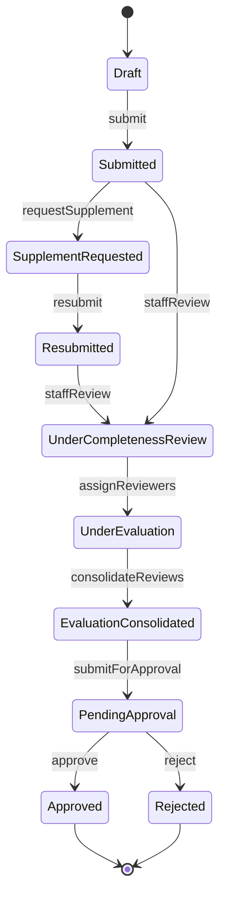
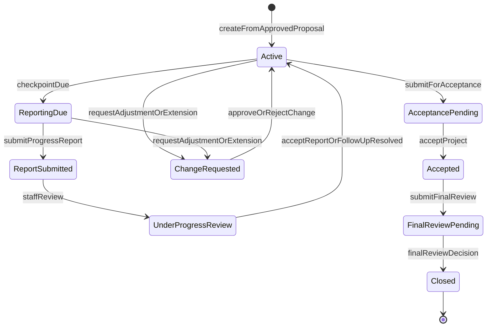
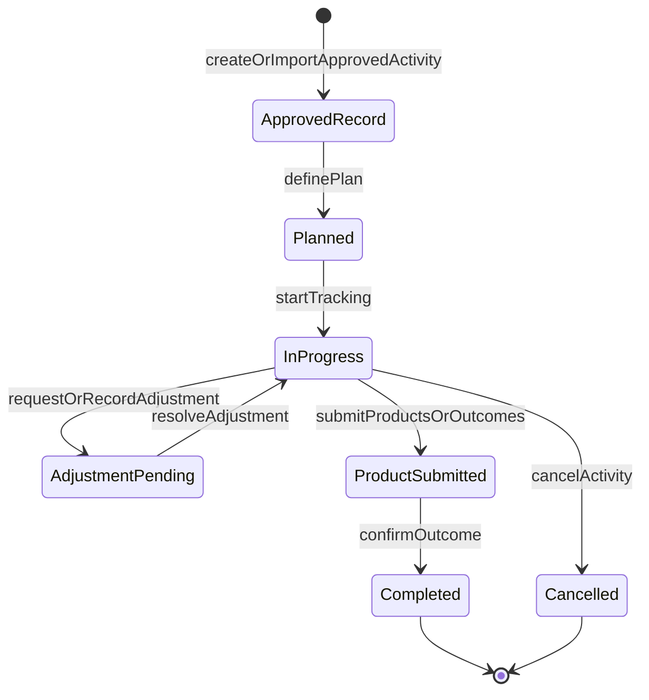
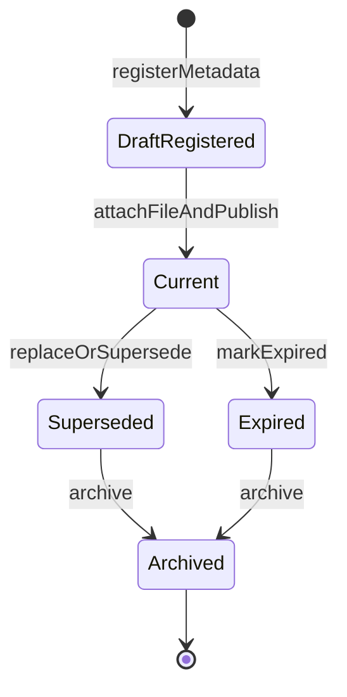
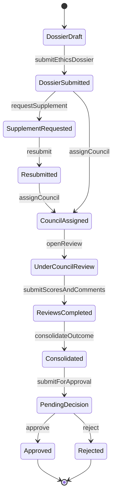
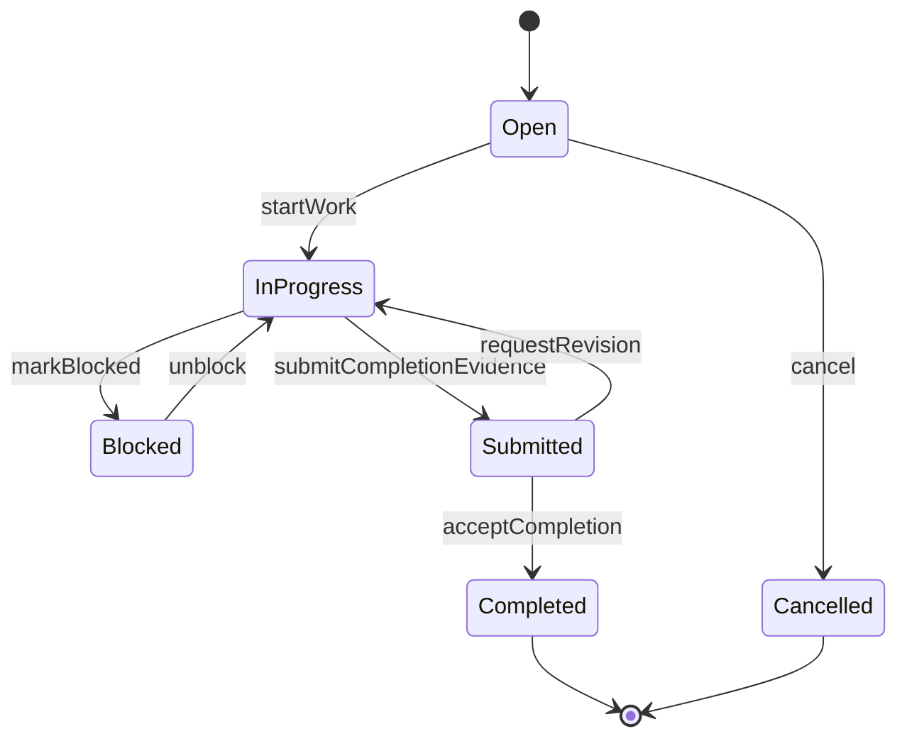

---
stepsCompleted:
  - 1
  - 2
  - 3
  - 4
  - 5
  - 6
  - 7
  - 8
inputDocuments:
  - "/Users/Super/DocManS/_bmad-output/prd.md"
  - "/Users/Super/DocManS/_bmad-output/project-context.md"
  - "/Users/Super/DocManS/_bmad-output/epics-and-stories.md"
  - "/Users/Super/DocManS/_bmad-output/detaiHVQY.md"
  - "/Users/Super/DocManS/docs/ux-design-guidelines.md"
workflowType: "architecture"
project_name: "DocManSystem"
user_name: "ThanhDaika"
date: "2026-04-27"
created: "2026-04-27T22:51:34+0700"
updated: "2026-07-29T00:00:00+0700"
lastStep: 8
status: "complete"
completedAt: "2026-04-27"
---

# Architecture Decision Document

_This document builds collaboratively through step-by-step discovery. Sections are appended as we work through each architectural decision together._

> **Reality baseline (2026-07-29):** This document is the adopted target
> architecture, not a statement that every decision is already implemented.
> Current code still contains multi-role/global business-role data and
> proposal-specific permission seams. The identity/authorization foundation
> must migrate and consolidate those seams before dependent features rely on
> the target contract.

## Project Context Analysis

### Requirements Overview

**Functional Requirements:**
RTMS requires a full internal workflow platform rather than isolated CRUD modules. Architecturally, the functional scope clusters into identity and organization management, shared catalogs and configuration, proposal intake and approval, approved-project tracking, seminar and student research tracking, task management, related-document management, council and ethics management, researcher profile management, files/history/auditability, notifications/reminders/work queues, and dashboard/reporting. These requirements imply a modular backend with explicit domain boundaries and a frontend organized around workflow-heavy admin experiences.

**Non-Functional Requirements:**
Architecture must satisfy backend-enforced authorization, controlled workflow state transitions, auditability of critical actions, file traceability, responsive list/detail/form experiences, WCAG AA baseline accessibility, transactional integrity for key workflow actions, and maintainability of a modular monolith. Performance expectations are strongest on authenticated list views, dashboard widgets, search/filter flows, and common workflow actions.

Authorization decisions must use the complete record context: one active
account-level system role, organization scope, typed record participation
roles, assignment scope, valid record delegation, workflow state, and conflict
policy. The architecture must preserve relationship lifecycle and must return
backend-derived capability and denial-reason data for permission-sensitive UI.

**Scale & Complexity:**
The project is a high-complexity internal web platform because it combines multi-role workflows, multi-stage approval paths, organization-scoped data visibility, role-scoped dashboards, audit-log requirements, reminder jobs, file-management controls, and dense administrative UX.

- Primary domain: internal research administration web platform
- Complexity level: high
- Estimated architectural components: 24-30 major application modules plus shared platform capabilities

### Technical Constraints & Dependencies

- Architecture must use a modular monolith for phase 1
- Frontend stack is Next.js, React, TypeScript
- Backend stack is NestJS, TypeScript
- Database is PostgreSQL with Prisma
- Redis is required for cache, queue, and reminder/notification job orchestration
- MinIO is required for file storage via S3-compatible access
- Deployment must use Docker Compose and Nginx
- No microservices, Kubernetes, SSO/LDAP/OIDC/MFA, or Elasticsearch/OpenSearch in phase 1
- Design must preserve future extensibility for identity integration and broader institutional integrations

### Cross-Cutting Concerns Identified

- role-based authorization across all protected operations
- data-scope authorization by unit/organization
- state-based authorization for workflow actions
- record-participation and assignment authorization for each business record
- explicit delegation lifecycle and separation-of-duty conflict enforcement
- backend-derived capability responses for record-role UX
- audit-log capture and queryability for critical business events
- file permission enforcement and file metadata traceability
- reminder and notification consistency with business deadlines
- dashboard and reporting aggregation within current-user scope
- responsive institutional admin UI patterns
- validation, error handling, and workflow history visibility

## Starter Template Evaluation

### Primary Technology Domain

Full-stack internal web platform based on a monorepo workspace, with:

- Next.js frontend
- NestJS backend
- shared TypeScript packages for contracts, validation, and domain utilities
- modular-monolith runtime boundaries inside the backend

### Starter Options Considered

**Option 1: Nx workspace as the primary starter**

- Official support for both Next.js and NestJS in one workspace
- Strong fit for monorepo task orchestration, shared libraries, code generation, and project graph awareness
- Better long-term support for AI-assisted implementation consistency across frontend, backend, and shared packages
- Strong match for RTMS because the project needs one repository with multiple apps and shared domain packages, but not microservices

**Option 2: Plain pnpm workspace + create-next-app + nest new**

- Simpler conceptual setup
- More manual repository wiring, task orchestration, and shared-package discipline
- Higher risk of inconsistent structure across apps and packages
- Acceptable, but weaker than Nx for this project’s scale and governance complexity

**Option 3: Nest monorepo mode as the primary starter**

- Good only for Nest-centric backends
- Not an ideal foundation for a Next.js + NestJS full-stack workspace
- Rejected as primary starter for RTMS

### Selected Starter: Nx workspace with package workspaces enabled

**Rationale for Selection:**
Nx is the strongest fit for RTMS phase 1 because it supports a single repository, clear app/package separation, Next.js and NestJS coexistence, shared TypeScript libraries, and disciplined scaling without forcing microservices. It also aligns well with the project-context requirement that AI agents should implement consistently across stories and modules.

**Initialization Command:**

```bash
npx create-nx-workspace@latest docmansystem --template=nrwl/empty-template --workspaces
cd docmansystem
nx add @nx/next
nx add @nx/nest
```

### Architectural Decisions Provided by Starter

**Language & Runtime:**

- TypeScript-first workspace
- One JavaScript/TypeScript monorepo with workspace-level task orchestration

**Styling Solution:**

- Frontend app can follow Next.js + Tailwind direction already required by project context and UX guideline

**Build Tooling:**

- Nx task orchestration and caching
- Framework-specific build/dev/test commands managed consistently across apps and packages

**Testing Framework:**

- Workspace-friendly test orchestration across frontend, backend, and shared packages
- Good basis for story-sized testing and CI verification

**Code Organization:**

- Strong fit for `apps/` plus `packages/` or `apps/` plus `libs/` style organization
- Clear boundaries between deployable apps and shared libraries

**Development Experience:**

- Better shared tooling consistency than a hand-assembled workspace
- Good support for incremental scaling of repository structure without changing the deployment model

**Note:** Project initialization using this command should be the first implementation story.

## Core Architectural Decisions

### Decision Priority Analysis

**Critical Decisions (Block Implementation):**

- Use a modular monolith in one Nx workspace
- Separate deployable frontend and backend apps, with shared packages
- Use PostgreSQL as the system of record with Prisma migrations
- Use Redis for cache, queue, reminder jobs, and notification orchestration
- Use MinIO as the file object store
- Enforce role-based, data-scope, and state-based authorization in backend services
- Enforce record participation, assignment, delegation, relationship
  lifecycle, and conflict policy in the same backend authorization decision
- Model proposal, approved-project, task, seminar/student research, related-document, council, and ethics workflows as explicit state machines
- Use Docker Compose and Nginx for phase 1 deployment
- Exclude microservices, Kubernetes, SSO, LDAP, OIDC, MFA, and Elasticsearch or OpenSearch from phase 1

**Important Decisions (Shape Architecture):**

- Use App Router-based Next.js admin application
- Use REST-style backend APIs with clear domain route groupings
- Keep business logic in NestJS services and domain-oriented modules
- Use shared packages for DTO contracts, validation schemas, permission primitives, and common types
- Use transactional workflow actions with audit-log capture as part of the application service layer
- Keep dashboard aggregation inside backend query and application services with scope-aware filtering

**Deferred Decisions (Post-MVP):**

- external identity integration
- search engine adoption beyond database-driven filtering
- deep analytics platforming
- event-driven decomposition into services
- cross-system workflow orchestration

### Data Architecture

- **Primary database:** PostgreSQL
- **ORM and migrations:** Prisma ORM 7.x with migration-driven schema evolution
- **Data modeling approach:** one relational database with clear schema ownership by domain module
- **Cache and jobs:** Redis for ephemeral caching, delayed reminders, notification dispatch, and queue-backed background work
- **Persistence rule:** PostgreSQL is the source of truth; Redis is auxiliary and disposable
- **Data integrity rule:** critical workflow actions must execute through transactional backend service flows
- **Schema boundary rule:** domain modules own their tables and relations; cross-module access goes through service and query boundaries, not ad hoc direct coupling

### Authentication & Security

- **Phase 1 authentication:** local application authentication with extensible adapter boundaries for future SSO
- **System-role model:** exactly one active account-level role per user:
  `SYSTEM_ADMIN`, `SCIENTIFIC_MANAGEMENT_STAFF`,
  `LEADERSHIP_APPROVAL_AUTHORITY`, or `RESEARCHER_INTERNAL_USER`
- **Record-role model:** PI, co-investigator, project member, scientific
  secretary, reviewer, council member, ethics reviewer, and task assignee are
  typed record relationships, never additional global roles
- **Authorization model:** system role plus organization/data scope plus
  record participation plus assignment scope plus valid delegation plus
  workflow state plus conflict policy
- **Session and security strategy:** authenticated web session or token-based app session, but always enforced server-side
- **Security middleware:** request validation, auth guards, permission checks, audit logging hooks, and rate protection for login-sensitive endpoints
- **Sensitive file rule:** file metadata visibility and file download access must be permission-checked every time
- **Resolver posture:** each applicable context dimension returns
  `resolved(value)`, `resolved(empty)`, or `unresolved/error`; inapplicable
  dimensions return `not-applicable`. Resolved-empty supplies no allow, while
  unresolved, failed, stale, or ambiguous applicable context fails closed.
- **Precedence rule:** every denial overrides additive permissions. When several
  denials apply, select the primary code in this order:
  `UNAUTHENTICATED`, `ORG_SCOPE_DENIED`, `RELATIONSHIP_INACTIVE`,
  `WORKFLOW_STATE_DENIED`, `CONFLICT_DENIED`, `DELEGATION_INVALID`,
  `ACTION_NOT_GRANTED`. Delegation cannot override a denial.

#### Authorization Decision Contract

Every protected application-service action must evaluate the same ordered
contract:

The normative field schemas, complete denial-code order, relationship
multiplicity, request-wide time, disclosure matrix, delegation/job envelopes,
personal-work aggregation, and integration fixtures are defined in
`planning-artifacts/architecture/architecture-DocManSystem-2026-07-29/AUTHORIZATION-CONTRACTS.md`.

1. Resolve the authenticated actor and active system role.
2. Resolve normalized organization/data scope: actor organization IDs, target
   organization ID, explicit cross-unit grants, and any assignment target. An
   action is in scope only through an explicit intersection, never an inferred
   hierarchy.
3. Resolve all active typed participation, assignment, council-membership, and
   task relationships for the target record.
4. Resolve an exact-match `PermissionActionV1` delegation grant initiated by
   the current action holder and approved by authorized scientific-management
   staff. The grant, grantor, delegate, and source authority must all be active
   at the database server's authoritative UTC time.
5. Evaluate workflow-state guards.
6. Evaluate conflict and separation-of-duty rules.
7. Allow only an explicitly permitted action. Otherwise deny with the
   deterministic primary `AuthorizationDecisionCodeV1`, plain-language reason,
   policy version, and evaluated context versions.

No controller, frontend component, dashboard query, export job, notification
job, or file endpoint may skip this contract or infer a “highest role.”
Applicable context resolvers must preserve the distinction between
resolved-empty, not-applicable, and unresolved/error.

#### Capability Response Contract

Protected record and list DTOs use the shared, versioned
`ViewerAuthorizationV1` shape:

```text
viewerAuthorization:
  schemaVersion: "v1"
  systemRole
  viewerRelationships[]
  allowedActions[]: PermissionActionV1
  blockedActions[]:
    action: PermissionActionV1
    code: AuthorizationDecisionCodeV1
    reason
  policyVersion
  evaluatedContextVersions[]
```

This response is descriptive, not a client-side authorization grant. Every
mutation re-evaluates authoritative context in the owning service's transaction
or validates the same context versions atomically. Lists may return the
versioned compact form, but it must preserve security-relevant viewer
relationships and blocked actions. Capability responses disclose only the
viewer's own relationships and facts needed to explain the result; they never
reveal another person's hidden assignment or the source of a conflict. Unknown
schema versions, action IDs, and denial codes fail closed in protected clients.

#### Delegation Contract

- The current action holder initiates an action-specific grant; authorized
  scientific management staff approves or revokes it.
- Each grant stores grantor, approver, delegate, target type/id, action set,
  start/end, status, revocation metadata, and audit context.
- Draft/edit/file and PI submission actions may be delegated when listed.
  Reviewer assignment, scoring, membership changes, approval, rejection, and
  final decisions are non-delegable.
- Ending the grantor's source relationship invalidates the grant immediately.
- Action IDs come from `PermissionActionV1`, use exact matching, and do not
  support wildcards or delegation chains.
- Grant intervals use database-server UTC and the half-open rule
  `startsAt <= asOf < endsAt`; a null end is unbounded. A grant is usable only
  when approved, active, unrevoked, both accounts are active, organization
  scope still intersects, and the source authority still grants that action.
- Delegation never widens organization scope, bypasses state, or overrides
  conflict policy.

#### Relationship Lifecycle Contract

- Participation, assignment, council membership, and delegation use
  database-server UTC instants and half-open intervals
  `effectiveFrom <= asOf < effectiveUntil`; a null end is unbounded.
- Status and interval must both be active. Revocation/inactivation wins
  immediately, including at an interval boundary.
- Lifecycle history is immutable and is corrected through auditable successor
  records, not physical deletion.
- Overlapping active relations of the same type for the same actor and record
  are rejected unless the owning domain explicitly declares multiplicity.
- API reads, jobs, audit, and tests use the same authoritative `asOf` instant.

#### Review Disclosure Contract

Before the configured disclosure state, PI, co-investigator, members, and
scientific secretaries receive no reviewer identity, raw score, reviewer
comment, or consolidated evaluation material in lists, details, files, exports,
notifications, dashboards, or history. After final decision, only the
policy-approved summary is exposed by default. Any wider institutional
disclosure requires a separately approved, versioned policy.

#### Mutation, Job, and Audit Contract

- The owning service binds authorization and mutation to one transaction or
  atomically validates record/context versions and rejects a mismatch.
- Background jobs run under a service principal, retain the initiating actor
  identity for audit, and re-authorize current source context before a
  protected notification, export, reminder, or projection side effect.
- `AuthorizationAuditV1` is append-only and records event/correlation ID,
  actor and service principal, target, exact action ID, authoritative time,
  policy/schema version, evaluated context versions, primary decision code,
  evaluated rule outcomes, and redacted before/after values.

### API & Communication Patterns

- **API style:** REST-style HTTP APIs grouped by domain module
- **Primary client communication:** frontend-to-backend HTTPS calls through Nginx reverse proxy
- **Route design convention:** `/api/v1/<domain-module>/...`
- **Error handling convention:** structured error envelope with machine-readable code, human-readable message, correlation metadata where useful, and validation details when applicable
- **Validation convention:** DTO validation at NestJS boundaries; business-rule validation inside application and domain services
- **Documentation approach:** OpenAPI generation from Nest where practical for internal developer clarity
- **Async communication:** background jobs for reminders, email notification dispatch, and heavier export and reporting work

### Frontend Architecture

- **Frontend runtime:** Next.js 16 App Router application
- **UI architecture:** admin-first route groups, shared layout shell, sidebar, topbar, and breadcrumb structure aligned to UX guideline
- **State management:** prefer server-driven data and route-local state first; introduce client state only where interaction complexity justifies it
- **Form architecture:** sectioned forms with validation, confirmation flows, and explicit workflow actions
- **Data-heavy screens:** tables on desktop, mobile-adapted list and card views, no full-page horizontal scrolling on mobile
- **Dashboard architecture:** role-aware server-backed dashboard sections with drill-down links into filtered operational lists
- **Permission-sensitive UI:** render record-role badges, enabled actions,
  visible disabled actions, and denial reasons from the capability response;
  never infer capabilities from the system role or collapse multiple
  relationships into a highest role
- **Personal work architecture:** one cross-module personal area for owned,
  participating, secretary, review, task, and pending-action items; each item
  is independently authorized and conflict-filtered by the backend

### Infrastructure & Deployment

- **Deployment model:** Docker Compose for phase 1 environments
- **Reverse proxy:** Nginx for routing, TLS termination, static asset serving policy, and upstream forwarding
- **Deployable units:** one frontend container, one backend container, one PostgreSQL service, one Redis service, one MinIO service, and one Nginx service
- **Environment strategy:** environment-variable driven configuration with separate settings for local, test, staging, and production-like deployments
- **Monitoring baseline:** structured app logs, error tracking, health checks, queue/job visibility, backup job visibility, and storage/database service monitoring
- **Scaling posture:** vertical-first and service-instance scaling within modular-monolith boundaries before any service decomposition

### Backup And Recovery

**Backup Ownership:**

- PostgreSQL is the source of truth for business state and must have scheduled logical backups plus tested restore procedures.
- MinIO stores business files and must have bucket/object backup or replication aligned with database backup windows.
- Redis is disposable supporting infrastructure for queues/cache; it does not replace PostgreSQL or MinIO backups.
- Application configuration and secrets must be recoverable from deployment-managed secret/config storage, not from source control.

**Minimum Phase 1 Policy:**

- PostgreSQL: nightly full logical backup for normal environments, with additional pre-deployment backup before risky migration windows.
- MinIO: nightly object backup or replication for buckets that contain business files, preserving object metadata needed by the files module.
- Prisma migrations: migration files are the recoverable schema history; every production-like restore must apply migrations and then validate application health checks.
- Backup retention: keep at least 7 daily restore points for phase 1 unless institutional policy requires longer retention.
- Restore testing: perform at least one restore rehearsal before pilot/UAT sign-off and repeat after major schema/storage changes.

**Recovery Targets:**

- Initial target RPO: 24 hours for phase 1 environments unless the academy defines a stricter operational policy.
- Initial target RTO: one business day for phase 1 recovery from backup, excluding infrastructure replacement lead time.
- Recovery verification must include database integrity checks, MinIO file access checks through the files module, login/auth checks, and smoke checks for proposal/project/task/dashboard workflows.

### Decision Impact Analysis

**Implementation Sequence:**

1. Initialize Nx workspace and create frontend and backend apps
2. Establish shared packages and repository conventions
3. Build authentication, organizations, roles, and permission primitives
4. Define Prisma schema foundations, researcher-profile/account linkage,
   typed participation relations, delegation grants, and the brownfield
   migration that removes global PI/reviewer/council authority, chooses one
   system-role source of truth, and consolidates existing permission seams
5. Implement the shared authorization decision contract, capability response,
   versioned action/decision/audit registries, conflict service, audit log, and
   minimum file infrastructure
6. Implement proposal and approved-project domain modules with state machines
   and typed participation/assignment relationships
7. Implement researcher-profile participation history before
   conflict-sensitive council and ethics assignment
8. Implement task, seminar/student-research, related-document, and
   council/ethics domains with their own authorized query contracts
9. Add domain reminder/search/dashboard/report/personal-work integrations only
   after each source domain is contract-complete: authoritative relationship
   and state resolvers, versioned authorized query DTO, mutation
   re-authorization, disclosure rules, and consumer contract tests

**Cross-Component Dependencies:**

- authorization depends on users, roles, organizations, assignments, and workflow states
- record authorization additionally depends on active participation,
  delegation, and conflict context owned by the target domain
- dashboards depend on scope-aware query services across multiple modules
- notifications and reminders depend on workflow events, deadlines, and Redis-backed jobs
- file management depends on permission checks, domain ownership, and audit logging
- audit logging depends on consistent application service boundaries across all modules
- related documents depend on the files module for object storage and on domain modules for link validation
- council and ethics workflows depend on researcher profiles, user accounts,
  typed participation/council relations, related documents, files,
  notifications, and audit logs; minimum researcher identity and linkage must
  be delivered first

## Implementation Patterns & Consistency Rules

### Pattern Categories Defined

**Critical Conflict Points Identified:**
10 areas where AI agents could make incompatible choices:

- database naming
- Prisma model boundaries
- API route naming
- DTO and validation placement
- frontend feature organization
- error response format
- date and time representation
- authorization policy invocation
- audit-log capture pattern
- background job and notification trigger pattern

### Naming Patterns

**Database Naming Conventions:**

- Use `snake_case` for database tables, columns, foreign keys, indexes, and constraint names
- Use plural table names for aggregate collections, for example `users`, `research_proposals`, `approved_projects`, `progress_reports`
- Use `<related_entity>_id` for foreign keys, for example `organization_id`, `proposal_id`, `reviewer_id`
- Use explicit join-table names such as `proposal_reviewers` or `project_members`
- Prisma model names remain `PascalCase`, but `@map` and `@@map` should preserve `snake_case` database names when needed

**API Naming Conventions:**

- Use plural resource-oriented route groups, for example `/api/v1/users`, `/api/v1/research-proposals`, `/api/v1/tasks`
- Use kebab-case for route segments, not camelCase
- Use query parameters in `camelCase` at HTTP contract level for frontend friendliness
- Use explicit action subpaths for workflow actions, for example:
  - `POST /api/v1/research-proposals/:id/submit`
  - `POST /api/v1/research-proposals/:id/request-supplement`
  - `POST /api/v1/approved-projects/:id/request-adjustment`

**Code Naming Conventions:**

- Use `PascalCase` for React components, NestJS classes, Prisma-facing domain types, and DTO classes
- Use `camelCase` for functions, variables, object fields, and TypeScript properties
- Use kebab-case for file names except where framework conventions strongly require otherwise
- Use explicit domain names instead of generic names such as `service`, `manager`, or `helper`

### Structure Patterns

**Project Organization:**

- Use one Nx workspace
- Use `apps/` for deployable applications
- Use `packages/` for shared code
- Organize both frontend and backend primarily by domain feature, not only by technical type
- Keep cross-cutting shared packages minimal and intentional

**Backend Structure Pattern:**

- Each domain module owns:
  - controller layer
  - application and service layer
  - domain rules and workflow transitions
  - persistence mapping or repository access
  - DTOs and policy hooks
- Do not place business logic in controllers
- Do not let one domain module reach directly into another module’s internal persistence layer without a defined boundary

**Frontend Structure Pattern:**

- Organize UI by feature area aligned to domain modules
- Keep shared UI primitives separate from feature-specific screens
- Keep route-level server data loading close to route boundaries
- Keep reusable form, table, and dashboard primitives in shared UI packages only when reuse is real

**Test Placement Pattern:**

- Prefer co-located unit tests near the implementation they verify
- Keep integration and end-to-end tests in clearly named higher-level test locations
- Ensure backend authorization, workflow, audit-log, and file-access tests are easy to find by feature

### Format Patterns

**API Response Formats:**

- Success responses should default to direct resource or list payloads unless pagination or metadata is needed
- Paginated list responses should use a consistent envelope such as:
  - `items`
  - `page`
  - `pageSize`
  - `total`
- Workflow action responses should include the updated resource state or a clearly typed action result, not ambiguous booleans only

**Error Response Structure:**

- Use a consistent error envelope:
  - `code`
  - `message`
  - `details` when validation or field-level context exists
  - `traceId` or correlation id when available
- Distinguish user-correctable validation errors from authorization, not-found, conflict, and server errors

**Date And Time Format:**

- Use ISO 8601 strings at API boundaries
- Store timestamps in UTC
- Convert for display in the UI layer only
- Do not mix timestamps, locale strings, and custom date formats across modules

### Communication Patterns

**Authorization Pattern:**

- Every protected backend action must evaluate:
  - authenticated actor
  - exactly one active account-level system role
  - organization or data scope
  - all active record participation roles
  - assignment or council-membership scope
  - valid action-specific delegation
  - state-based permission if applicable
  - conflict and separation-of-duty policy
- Deny rules take precedence over additive allows, and missing context fails
  closed
- Authorization logic must not live only in decorators or only in frontend guards; it must be enforced by backend application services through one shared policy contract
- Domain modules own relationship resolution and action rules; the shared
  authorization service composes them and returns capability/denial results

**Audit-Log Pattern:**

- Audit-log capture must happen as part of the same application use case that changes business state
- Log structure should consistently capture:
  - actor
  - action
  - target type
  - target id
  - timestamp
  - relevant before and after or contextual metadata
- Do not leave audit logging to ad hoc controller code

**Notification And Job Pattern:**

- Business actions emit internal application events or invoke explicit notification services
- Reminder and notification jobs must use consistent payload structures and idempotency keys where applicable
- Redis-backed jobs must be used for delayed or retryable background work, not for source-of-truth state

### Process Patterns

**Validation Pattern:**

- Use DTO validation for boundary validation
- Use application and domain validation for workflow and business-rule validation
- Frontend validation improves UX but never replaces backend validation

**Loading State Pattern:**

- Frontend should treat loading, empty, success, and error states as first-class states for all data-heavy screens
- Long-running exports or workflow actions should show explicit progress or completion signaling where relevant

**Workflow Transition Pattern:**

- Proposal, approved-project, task, seminar/student research, related-document, council, and ethics-dossier state transitions must be executed through named application actions
- Direct arbitrary state mutation is forbidden
- Transition guards must be centralized and testable
- Each workflow-owning module must expose transition functions that perform authorization, validation, persistence, audit logging, and notification hooks in one application flow where applicable

## Authorization Architecture Spine

This is an adopted target contract. `[ADOPTED]` means accepted from the
planning sources, not already implemented; the brownfield migration in AD-12
must complete before dependent stories rely on it.

### AD-1 — Account Role Cardinality [ADOPTED]

- **Binds:** auth, users, navigation, seed data
- **Prevents:** stacked global PI/member/secretary/reviewer authority
- **Rule:** each account has exactly one active system role; business roles are
  typed record relationships

### AD-2 — Complete Authorization Context [ADOPTED]

- **Binds:** every protected query, mutation, export, file action, job, and
  notification
- **Prevents:** role-only or scope-only permission decisions
- **Rule:** evaluate system role, organization scope, active record
  relationships, assignment scope, valid delegation, workflow state, and
  conflict policy; applicable resolvers distinguish resolved-value,
  resolved-empty, not-applicable, and unresolved/error; only unresolved,
  failed, stale, or ambiguous applicable context fails closed

### AD-3 — Deny Precedence [ADOPTED]

- **Binds:** policy evaluation and capability projection
- **Prevents:** highest-role, role-union, or delegation bypass
- **Rule:** all denials override additive allows; simultaneous denials use the
  complete ordered `AuthorizationDecisionCodeV1` registry, including
  unresolved/stale/ambiguous/unknown-contract/context-version failures

### AD-4 — Domain-Owned Relationships [ADOPTED]

- **Binds:** proposal, project, council, ethics, review, task, and researcher
  modules
- **Prevents:** one generic participation table erasing domain conflict rules
- **Rule:** source domains own typed relationships and lifecycle; researcher
  profiles own shared identity; authorized history is a query-on-read
  aggregation and never an authorization or mutation source of truth

### AD-5 — Explicit Delegation [ADOPTED]

- **Binds:** governance, audit, source-domain action policies
- **Prevents:** informal “act on behalf of” access
- **Rule:** only current-holder-initiated, staff-approved, active, unrevoked,
  exact-action, time-bounded grants are valid; source authority must remain
  active; wildcards and chains are forbidden; reviewer assignment, scoring,
  membership changes, approval, rejection, and final decisions are
  non-delegable

### AD-6 — Server Capability Contract [ADOPTED]

- **Binds:** API DTOs, web UI, mobile layouts, tests
- **Prevents:** frontend permission inference and unexplained hidden actions
- **Rule:** one versioned shared DTO states minimum-disclosure viewer
  relationships, allowed actions, blocked actions, stable codes, reasons, and
  evaluated context versions; unknown versions/codes fail closed, and
  mutations re-evaluate authoritative context atomically

### AD-7 — Conflict-Safe Personal Work [ADOPTED]

- **Binds:** personal work hub, dashboards, work queues
- **Prevents:** cross-module count leakage and conflicted approval items
- **Rule:** query source-domain authorized contracts at read time, exclude
  inaccessible items from results and counts, and exclude conflicted items
  from enabled/actionable queues while preserving a minimal blocked item with
  the backend denial code and reason

### AD-8 — Dependency Ordering [ADOPTED]

- **Binds:** epic and story sequencing
- **Prevents:** aggregate features depending on future domain contracts
- **Rule:** deliver identity/participation foundations before conflict-sensitive
  council work; add file, reminder, search, dashboard, report, and personal-hub
  integrations only after each source domain exists

### AD-9 — Canonical Lifecycle Time [ADOPTED]

- **Binds:** participation, assignment, council membership, delegation, jobs,
  audit, and tests
- **Prevents:** different authority at time-zone or end-date boundaries
- **Rule:** use database-server UTC and half-open intervals
  `effectiveFrom <= asOf < effectiveUntil`; revocation wins immediately,
  lifecycle history is immutable, and overlapping active same-type relations
  are rejected unless the owning domain explicitly permits multiplicity

### AD-10 — Shared Contract Registries [ADOPTED]

- **Binds:** shared permissions package, source domains, API clients, audit
- **Prevents:** incompatible action IDs, denial codes, capability shapes, and
  audit interpretations
- **Rule:** versioned action, decision-code, viewer-authorization,
  personal-work-entry, and authorization-audit contracts have one shared owner;
  their normative schemas and canonical fixtures are defined in
  `AUTHORIZATION-CONTRACTS.md`; action matching is exact and unknown values deny

### AD-11 — Restricted Review Disclosure [ADOPTED]

- **Binds:** lists, details, files, exports, notifications, dashboards, history,
  proposal, review, council, and ethics
- **Prevents:** leaking reviewer identities or internal evaluation material
- **Rule:** before disclosure state, PI, co-investigator, members, and
  secretaries receive no reviewer identity, raw score, comment, or
  consolidation data; all surfaces and the published summary follow the
  normative disclosure matrix

### AD-12 — Brownfield Authorization Migration [ADOPTED]

- **Binds:** Prisma role data, seeds, auth/session DTOs, permission types,
  navigation, current permission seams, and dependent stories
- **Prevents:** old global roles and new record policy granting in parallel
- **Rule:** foundation work chooses one system-role source of truth, migrates
  legacy business-role accounts to canonical system role plus typed record
  relations, enforces one active system role, and consolidates existing
  permission seams before dependent work

### AD-13 — Authoritative Commands and Jobs [ADOPTED]

- **Binds:** mutations, delayed jobs, reminders, notifications, exports, audit
- **Prevents:** time-of-check/time-of-use grants and stale queued authority
- **Rule:** authorize and mutate in one transaction or atomically validate
  `ContextVersionTokenV1`; jobs use `AuthorizationJobEnvelopeV1` service-only
  or on-behalf-of semantics and cancel when current authority no longer holds

### AD-14 — Contract-Complete Integration Gate [ADOPTED]

- **Binds:** source domains and file, reminder, search, dashboard, report, and
  personal-work consumers
- **Prevents:** integrations against incomplete tables or DTOs
- **Rule:** a source is integration-ready only with authoritative
  relationship/state resolvers, a versioned authorized query contract,
  mutation re-authorization, disclosure rules, and the canonical producer and
  consumer fixture suite; any enabled-source failure follows the normative
  whole-response fail-closed contract

### Deferred

- External identity integration and multiple active system roles remain outside
  phase 1.
- Any institution-approved widening beyond AD-11 requires a future versioned
  policy decision; the restricted default remains binding until then.
- The scientist-permission file is treated as the product owner's accepted
  planning policy; institutional governance approval is a production/UAT
  sign-off item.

## Workflow State Machine Diagrams

These diagrams define the target architecture-level state boundaries. Story implementations may introduce only the subset required by the active story, but must not bypass these controlled transition shapes.

### Proposal Intake And Approval State Machine



### Approved Project State Machine



### Seminar And Student Research State Machine



### Related Document Lifecycle State Machine



### Council And Ethics State Machine



### Task State Machine



### Enforcement Guidelines

**All AI Agents MUST:**

- preserve modular domain boundaries
- use the agreed naming conventions for database, API, and code
- enforce authorization, audit logging, and workflow transition rules in backend application flow
- keep API contracts and error envelopes consistent
- avoid introducing new cross-cutting patterns without updating architecture documentation

**Pattern Enforcement:**

- architecture review checks repository placement, naming, API format, and boundary ownership
- PR review checks authorization, audit-log, workflow-state, and file-access consistency
- story validation checks whether new code follows existing package, module, DTO, and route patterns

### Pattern Examples

**Good Examples:**

- `POST /api/v1/research-proposals/:id/submit`
- `research_proposals` table with Prisma model `ResearchProposal`
- `RequestSupplementDto` in the proposal module
- `ResearchProposalService.requestSupplement(...)` performs authorization, state transition, persistence, and audit logging in one application flow

**Anti-Patterns:**

- generic routes such as `/api/doAction`
- controller-owned business rules
- mixed `snake_case` and `camelCase` database columns without mapping discipline
- frontend-only permission checks for protected actions
- direct state edits that bypass transition rules
- notification side effects scattered across controllers and UI code

## Project Structure & Boundaries

### Target Project Directory Structure

The tree below is the target layout, not a claim that every path currently
exists. Existing `apps/api/src/permissions/`, proposal authorization seams, and
the current `packages/permissions/` contract must be migrated or consolidated
into it; do not create a parallel policy system.

```text
docmansystem/
├── README.md
├── package.json
├── pnpm-workspace.yaml
├── nx.json
├── tsconfig.base.json
├── .gitignore
├── .env.example
├── docker-compose.yml
├── nginx/
│   ├── nginx.conf
│   └── conf.d/
│       └── rtms.conf
├── apps/
│   ├── web/
│   │   ├── project.json
│   │   ├── next.config.ts
│   │   ├── tsconfig.json
│   │   ├── public/
│   │   │   └── assets/
│   │   └── src/
│   │       ├── app/
│   │       │   ├── (auth)/
│   │       │   ├── (dashboard)/
│   │       │   ├── research-proposals/
│   │       │   ├── approved-projects/
│   │       │   ├── seminars/
│   │       │   ├── student-research/
│   │       │   ├── related-documents/
│   │       │   ├── councils/
│   │       │   ├── ethics-dossiers/
│   │       │   ├── researcher-profiles/
│   │       │   ├── tasks/
│   │       │   ├── reports/
│   │       │   ├── settings/
│   │       │   ├── layout.tsx
│   │       │   ├── page.tsx
│   │       │   └── globals.css
│   │       ├── features/
│   │       │   ├── auth/
│   │       │   ├── dashboard/
│   │       │   ├── research-proposals/
│   │       │   ├── proposal-evaluations/
│   │       │   ├── approvals/
│   │       │   ├── approved-projects/
│   │       │   ├── progress-reports/
│   │       │   ├── adjustment-requests/
│   │       │   ├── acceptance/
│   │       │   ├── seminars/
│   │       │   ├── student-research/
│   │       │   ├── related-documents/
│   │       │   ├── councils/
│   │       │   ├── ethics-dossiers/
│   │       │   ├── council-evaluations/
│   │       │   ├── researcher-profiles/
│   │       │   ├── tasks/
│   │       │   ├── notifications/
│   │       │   ├── personal-work/
│   │       │   ├── files/
│   │       │   └── reports/
│   │       ├── components/
│   │       │   ├── ui/
│   │       │   ├── layout/
│   │       │   ├── tables/
│   │       │   ├── forms/
│   │       │   ├── status/
│   │       │   ├── timeline/
│   │       │   └── charts/
│   │       ├── lib/
│   │       │   ├── api-client/
│   │       │   ├── auth/
│   │       │   ├── permissions/
│   │       │   ├── formatting/
│   │       │   └── utils/
│   │       ├── hooks/
│   │       └── middleware.ts
│   └── api/
│       ├── project.json
│       ├── nest-cli.json
│       ├── tsconfig.app.json
│       ├── tsconfig.spec.json
│       ├── prisma/
│       │   ├── schema.prisma
│       │   ├── migrations/
│       │   └── seed/
│       └── src/
│           ├── main.ts
│           ├── app.module.ts
│           ├── config/
│           ├── common/
│           │   ├── auth/
│           │   ├── authorization/
│           │   ├── dto/
│           │   ├── exceptions/
│           │   ├── filters/
│           │   ├── guards/
│           │   ├── interceptors/
│           │   ├── pipes/
│           │   ├── logging/
│           │   └── utils/
│           ├── infrastructure/
│           │   ├── prisma/
│           │   ├── redis/
│           │   ├── minio/
│           │   ├── mail/
│           │   ├── queue/
│           │   └── scheduler/
│           ├── modules/
│           │   ├── auth/
│           │   ├── users/
│           │   ├── roles/
│           │   ├── organizations/
│           │   ├── catalogs/
│           │   ├── research-proposals/
│           │   ├── proposal-intake-periods/
│           │   ├── proposal-evaluations/
│           │   ├── approvals/
│           │   ├── approved-projects/
│           │   ├── progress-milestones/
│           │   ├── progress-reports/
│           │   ├── adjustment-requests/
│           │   ├── acceptance/
│           │   ├── final-review/
│           │   ├── seminars/
│           │   ├── student-research/
│           │   ├── related-documents/
│           │   ├── councils/
│           │   ├── ethics-dossiers/
│           │   ├── council-evaluations/
│           │   ├── researcher-profiles/
│           │   ├── tasks/
│           │   ├── notifications/
│           │   ├── delegations/
│           │   ├── personal-work/
│           │   ├── files/
│           │   ├── audit-logs/
│           │   ├── dashboard/
│           │   └── reports/
│           └── jobs/
│               ├── reminders/
│               ├── notifications/
│               └── exports/
├── packages/
│   ├── contracts/
│   │   ├── src/
│   │   │   ├── api/
│   │   │   ├── dto/
│   │   │   └── enums/
│   ├── domain-types/
│   │   └── src/
│   ├── validation/
│   │   └── src/
│   ├── permissions/
│   │   └── src/
│   ├── ui-tokens/
│   │   └── src/
│   ├── eslint-config/
│   └── tsconfig/
├── tools/
│   ├── scripts/
│   └── generators/
└── tests/
    ├── e2e/
    │   ├── web/
    │   └── api/
    ├── integration/
    │   └── api/
    └── fixtures/
```

### Architectural Boundaries

**API Boundaries:**

- `apps/api` is the only service that owns business-state mutation and protected workflow decisions
- `apps/web` never bypasses the API to access persistence directly
- Public route surface is limited to authenticated internal APIs under `/api/v1`
- Domain routes are grouped by module and workflow action

**Component Boundaries:**

- `apps/web/src/features/*` owns feature-specific UI and orchestration
- `apps/web/src/components/ui/*` owns reusable design primitives only
- `apps/web/src/components/layout/*` owns shell and navigation structure
- Dashboard widgets, proposal forms, seminar/student research views, related-document views, council/ethics views, researcher-profile views, task views, and timeline/history views live in feature modules, not generic shared buckets
- Personal-work views consume an authorized cross-module read contract; they
  do not own or widen source-domain permissions

**Service Boundaries:**

- Each backend domain module owns its own controller, application service, policy checks, and persistence integration
- Cross-module reads should prefer query and application services
- Cross-module writes must go through explicit service APIs or orchestration flows, not direct repository reach-through

**Data Boundaries:**

- One PostgreSQL database, but clear module ownership by table and relation
- Prisma schema is physically centralized but logically partitioned by domain comment blocks and ownership rules
- Redis never becomes source-of-truth persistence
- MinIO object storage is accessed only through the files module and supporting infrastructure adapters
- Runtime business uploads are stored only in MinIO; PostgreSQL stores shared file metadata in `file_records`
- Domain modules reference files by metadata records and related entity associations, never by direct MinIO object keys

### Requirements To Structure Mapping

**Feature Mapping:**

- Research proposal intake and approval → `research-proposals`, `proposal-intake-periods`, `proposal-evaluations`, `approvals`, `files`, `audit-logs`, `notifications`
- Approved project tracking → `approved-projects`, `progress-milestones`, `progress-reports`, `adjustment-requests`, `acceptance`, `final-review`, `files`, `audit-logs`
- Seminar and student research tracking → `seminars`, `student-research`, `related-documents`, `files`, `audit-logs`, `notifications`, `dashboard`
- Related-document management → `related-documents`, `files`, `audit-logs`, plus link validation through target domain services
- Council and ethics management → `councils`, `ethics-dossiers`, `council-evaluations`, `related-documents`, `researcher-profiles`, `files`, `audit-logs`, `notifications`
- Researcher profile management → `researcher-profiles`, `users`, `organizations`, `catalogs`, `audit-logs`, plus participation links to operational modules
- Task management → `tasks`, `notifications`, `audit-logs`, `dashboard`
- Role-based dashboard and reporting → `dashboard`, `reports`, plus read-side queries from all operational modules including seminars, student research, related documents, councils, ethics dossiers, and researcher profiles

**Cross-Cutting Concerns:**

- Authentication and sessions → `auth`, shared guards and strategies, frontend auth lib
- Password change/reset → `auth`, `users`, audit logging, backend credential policy utilities
- Role and scope permissions → `roles`, `organizations`, shared `permissions` package, backend authorization layer
- Record participation, assignment, conflict, and delegation → owning domain
  modules plus `delegations`, shared `permissions`, and the backend
  authorization layer
- Personal work hub → `personal-work` read module plus authorized query
  contracts from each source domain
- File management → `files` module plus `infrastructure/minio`; `file_records` is the shared metadata table
- Audit logging → `audit-logs` module plus common logging hooks
- Reminder and notification jobs → `notifications` module plus `jobs/reminders` plus Redis queue and scheduler
- Shared DTOs, enums, and contracts → `packages/contracts`, `packages/domain-types`, `packages/validation`

### ER Diagram

This ER diagram is intentionally architecture-level. It shows ownership and major relationships; detailed fields and constraints belong in Prisma migrations and story implementation notes.

```mermaid
erDiagram
    ORGANIZATIONS ||--o{ USERS : scopes
    USERS ||--o{ USER_ROLES : has
    ROLES ||--o{ USER_ROLES : assigned
    USERS ||--o| RESEARCHER_PROFILES : may_link
    ORGANIZATIONS ||--o{ RESEARCHER_PROFILES : owns

    PROPOSAL_INTAKE_PERIODS ||--o{ RESEARCH_PROPOSALS : accepts
    RESEARCH_PROPOSALS ||--o{ PROPOSAL_MEMBERS : has
    RESEARCHER_PROFILES ||--o{ PROPOSAL_MEMBERS : participates
    RESEARCH_PROPOSALS ||--o{ PROPOSAL_SUPPLEMENT_REQUESTS : has
    RESEARCH_PROPOSALS ||--o{ PROPOSAL_EVALUATION_ASSIGNMENTS : assigns
    PROPOSAL_EVALUATION_ASSIGNMENTS ||--o{ PROPOSAL_EVALUATIONS : produces
    RESEARCH_PROPOSALS ||--o{ PROPOSAL_APPROVAL_DECISIONS : receives
    RESEARCH_PROPOSALS ||--o| APPROVED_PROJECTS : becomes

    APPROVED_PROJECTS ||--o{ PROJECT_MEMBERS : has
    RESEARCHER_PROFILES ||--o{ PROJECT_MEMBERS : participates
    APPROVED_PROJECTS ||--o{ PROGRESS_MILESTONES : plans
    PROGRESS_MILESTONES ||--o{ PROGRESS_REPORTS : receives
    APPROVED_PROJECTS ||--o{ ADJUSTMENT_REQUESTS : changes
    APPROVED_PROJECTS ||--o{ ACCEPTANCE_REVIEWS : closes
    APPROVED_PROJECTS ||--o{ FINAL_REVIEW_DECISIONS : finalizes

    SEMINARS ||--o{ SEMINAR_PARTICIPANTS : has
    STUDENT_RESEARCH_ACTIVITIES ||--o{ STUDENT_RESEARCH_PARTICIPANTS : has
    RESEARCHER_PROFILES ||--o{ SEMINAR_PARTICIPANTS : participates
    RESEARCHER_PROFILES ||--o{ STUDENT_RESEARCH_PARTICIPANTS : supervises_or_participates

    COUNCILS ||--o{ COUNCIL_MEMBERS : has
    RESEARCHER_PROFILES ||--o{ COUNCIL_MEMBERS : serves
    ETHICS_DOSSIERS ||--o{ COUNCIL_EVALUATION_ASSIGNMENTS : assigns
    COUNCIL_EVALUATION_ASSIGNMENTS ||--o{ COUNCIL_EVALUATIONS : produces
    ETHICS_DOSSIERS ||--o{ ETHICS_SUPPLEMENT_REQUESTS : has
    ETHICS_DOSSIERS ||--o{ COUNCIL_DECISIONS : receives
    COUNCILS ||--o{ ETHICS_DOSSIERS : reviews

    RELATED_DOCUMENTS ||--o{ RELATED_DOCUMENT_LINKS : links
    FILE_RECORDS ||--o{ RELATED_DOCUMENTS : stores_document_file
    FILE_RECORDS ||--o{ RESEARCH_PROPOSALS : attaches_to
    FILE_RECORDS ||--o{ APPROVED_PROJECTS : attaches_to
    FILE_RECORDS ||--o{ ETHICS_DOSSIERS : attaches_to

    TASKS ||--o{ TASK_ASSIGNMENTS : has
    USERS ||--o{ TASK_ASSIGNMENTS : assigned
    AUDIT_LOGS }o--|| USERS : actor
    NOTIFICATIONS }o--|| USERS : recipient
```



### Core Domain Entities

**Identity & Governance:**

- User
- Role
- Permission
- Organization
- UserRoleAssignment
- UserOrganizationScope
- ResearcherProfile

**Proposal Lifecycle:**

- ProposalIntakePeriod
- ResearchProposal
- ProposalMember
- ProposalAttachment
- ProposalSupplementRequest
- ProposalEvaluationAssignment
- ProposalEvaluation
- ProposalApprovalDecision

**Approved Project Lifecycle:**

- ApprovedProject
- ProjectMember
- ProgressMilestone
- ProgressReport
- ProjectAttachment
- AdjustmentRequest
- AcceptanceReview
- FinalReviewDecision

**Seminar And Student Research:**

- Seminar
- SeminarParticipant
- StudentResearchActivity
- StudentResearchParticipant
- ActivityMilestone
- ActivityAdjustment
- ActivityProduct

**Related Documents:**

- RelatedDocument
- RelatedDocumentLink
- RelatedDocumentVersion
- RelatedDocumentReplacement

**Council And Ethics:**

- Council
- CouncilMember
- EthicsDossier
- EthicsSupplementRequest
- CouncilEvaluationAssignment
- CouncilEvaluation
- CouncilDecision

**Task & Support:**

- Task
- TaskAssignment
- Notification
- ReminderJob
- AuditLog
- ReportDefinition
- ExportJob
- FileRecord

### Database Schema Boundaries

**Auth / Governance Ownership:**

- `users`
- `roles`
- `permissions`
- `user_roles`
- `organizations`
- `user_organization_scopes`
- `password_reset_tokens`
- `record_delegations`

**Researcher Profile Ownership:**

- `researcher_profiles`
- `researcher_profile_user_links`
- `researcher_expertise_keywords`
- `researcher_participation_links`

**Proposal Domain Ownership:**

- `proposal_intake_periods`
- `research_proposals`
- `proposal_members`
- `proposal_attachments`
- `proposal_supplement_requests`
- `proposal_evaluation_assignments`
- `proposal_evaluations`
- `proposal_approval_decisions`

**Approved Project Domain Ownership:**

- `approved_projects`
- `project_members`
- `progress_milestones`
- `progress_reports`
- `project_attachments`
- `adjustment_requests`
- `acceptance_reviews`
- `final_review_decisions`

**Seminar And Student Research Domain Ownership:**

- `seminars`
- `seminar_participants`
- `student_research_activities`
- `student_research_participants`
- `activity_milestones`
- `activity_adjustments`
- `activity_products`

**Related Document Domain Ownership:**

- `related_documents`
- `related_document_links`
- `related_document_versions`
- `related_document_replacements`

**Council And Ethics Domain Ownership:**

- `councils`
- `council_members`
- `ethics_dossiers`
- `ethics_dossier_attachments`
- `ethics_supplement_requests`
- `council_evaluation_assignments`
- `council_evaluations`
- `council_decisions`

**Operational Support Ownership:**

- `tasks`
- `task_assignments`
- `notifications`
- `audit_logs`
- `file_records`
- `export_jobs`

**Authorization Data Ownership Invariants:**

- `user_roles` enforces at most one active system-role assignment per account
  in phase 1.
- `proposal_members`, `project_members`, `seminar_participants`,
  `student_research_participants`, `council_members`, evaluation assignments,
  and task assignments own their typed role, status, and effective dates.
- Co-investigator is a distinct participation value with project-member
  default authority unless an explicit responsibility or delegation grants
  more.
- `researcher_participation_links`, if retained, is a rebuildable read-only
  directory/history index. Phase-1 authorized history uses query-on-read source
  contracts; the index is never a mutation or authorization source of truth,
  and corrections/deletions follow the owning source-domain lifecycle.
- Each owning domain resolves its active relationships for the shared
  authorization service. Generic polymorphic links must not replace
  domain-specific conflict rules.
- `record_delegations` is owned by governance, uses exact
  `PermissionActionV1` identifiers and UTC half-open validity intervals, and is
  authoritatively validated against target scope, both accounts, grant status,
  and the grantor's source action inside every protected mutation.

**Brownfield migration invariant:**

- Existing `User.role`, `UserRoleAssignment`, auth/session `roles[]`, global
  PI/reviewer/council permission constants, navigation assumptions, seed data,
  and proposal-specific authorization seams must be inventoried and migrated.
- Foundation work chooses one persistence source for the single active system
  role, maps existing business-role users to a canonical system role plus typed
  record relationships, and prevents legacy and target policies from granting
  authority in parallel.
- Existing `apps/api/src/permissions/`, `apps/api/src/proposals-shared/`, and
  `packages/permissions/` seams are consolidated or migrated; a second parallel
  policy engine is forbidden.

**Shared read-model invariant:**

- Researcher history and personal work query versioned authorized source-domain
  contracts at request time in phase 1. A source returns completeness,
  source/context version, and observation time; unresolved/stale/partial source
  results fail closed and do not contribute items or counts.
- `PersonalWorkEntryV1` carries source domain, stable source ID, record/context
  version, exact target action, route reference, actionable flag, and a
  minimum-disclosure blocked code/reason. Source mutations reject stale context
  deterministically.
- Conflicted records remain visible only as minimally identified blocked items;
  they are excluded from actionable counts and enabled queues. Hidden
  assignments or conflict-source facts are never disclosed.

### Integration Points

**Internal Communication:**

- frontend to API via HTTP
- domain module to domain module via explicit service and query boundaries
- workflow side effects to notifications, audit, and files via application orchestration
- async reminders and exports via Redis-backed jobs

**External Integrations:**

- MinIO for object storage
- SMTP or mail provider for email notifications
- Nginx reverse proxy in front of web and API
- future identity integration reserved behind auth boundary

**Data Flow:**

- user action enters web route
- web calls backend API
- backend validates DTO plus permission plus state transition
- backend resolves active record relationships and delegation, then evaluates
  state and conflict policy
- backend persists via Prisma and PostgreSQL
- backend emits audit, notification, and file side effects
- background jobs handle delayed reminders, email dispatch, and heavy exports

### File Organization Patterns

**Configuration Files:**

- workspace-level config at root
- app-specific runtime config inside each app
- infra config under `nginx/`, `docker-compose.yml`, and app config modules

**Source Organization:**

- apps for deployables, packages for shared code
- backend modules by domain
- frontend features by domain
- no generic dumping grounds for business logic
- shared authorization depends on domain fact-provider ports and versioned
  contracts, never domain persistence models
- domains consume shared decision/action contracts and do not reinterpret
  policy internals; architecture tests enforce this dependency direction

**Test Organization:**

- unit tests close to implementation
- integration tests grouped under backend integration suites
- e2e tests split by web and api behavior
- fixtures centralized under `tests/fixtures`

**Asset Organization:**

- static public assets under `apps/web/public/assets`
- no business file uploads stored in repo
- runtime uploads only in MinIO via files module

### Development Workflow Integration

**Development Server Structure:**

- Nx runs web and api as separate apps in one workspace
- shared packages rebuilt or watched through workspace tooling
- local infra services via Docker Compose when needed

**Build Process Structure:**

- web and api build independently
- shared packages versioned inside workspace
- Prisma generation and migrations remain backend-owned steps

**Deployment Structure:**

- Docker Compose orchestrates frontend, API, PostgreSQL, Redis, MinIO, and Nginx
- Nginx routes browser traffic to web and API paths
- storage, queue, and database remain internal supporting services for the modular monolith

## Architecture Validation Results

### Coherence Validation ✅

**Decision Compatibility:**
The chosen stack and architectural decisions are compatible. Nx workspace, Next.js frontend, NestJS backend, PostgreSQL with Prisma, Redis-backed jobs, MinIO object storage, Nginx reverse proxy, and Docker Compose deployment all fit a phase 1 modular monolith without forcing premature service decomposition.

**Pattern Consistency:**
The implementation patterns reinforce the architecture rather than contradict it. Naming, routing, DTO validation, authorization enforcement, audit-log capture, background job handling, and workflow transition patterns are aligned with the chosen stack and domain rules.

**Structure Alignment:**
The target project structure supports the architectural decisions. Its
brownfield transition explicitly consolidates the current permission seams
before dependent modules are added, avoiding parallel policy engines.

### Requirements Coverage Validation ✅

**Feature Coverage:**
The core modules from the PRD and `detaiHVQY.md` are represented structurally and logically:

- research proposal intake and approval
- approved project tracking
- seminar and student research tracking
- task management
- role-based dashboard and reports
- related-document management
- council and ethics management
- researcher profile management

**Functional Requirements Coverage:**
The architecture supports identity and governance, catalogs, researcher profiles, workflows, files, related documents, council/ethics operations, notifications, reminders, dashboards, reporting, and auditability.

**Non-Functional Requirements Coverage:**
The architecture addresses performance-sensitive views, backend-first security, workflow integrity, accessibility constraints, modular maintainability, and deployment simplicity for phase 1.

### Implementation Readiness Validation ✅

**Decision Completeness:**
Critical implementation-blocking decisions have been made:

- workspace model
- frontend and backend stack
- persistence model
- file storage model
- queue and cache model
- deployment model
- authorization and governance approach

**Structure Completeness:**
The repository structure, module structure, shared package structure, and integration boundaries are defined clearly enough for implementation planning.

**Pattern Completeness:**
The architecture specifies enough conventions to reduce drift between agents in naming, API design, validation, workflow transitions, error handling, and job orchestration.

### Gap Analysis Results

**Critical Gaps:** None

**Important Gaps:**

- API conventions can be made sharper for filtering, pagination, and workflow-action endpoints
- the exact SQL/data rollout for legacy global business-role migration remains
  story-level work, but AD-12 fixes its required completion conditions

**Nice-to-Have Gaps:**

- example request and response envelopes for common list and action endpoints
- observability taxonomy beyond the required `AuthorizationAuditV1` envelope
- institution-approved widening of review disclosure beyond the binding
  restricted default

### Validation Issues Addressed

- The architecture preserves modular-monolith constraints and avoids phase 1 scope violations
- No contradictory technology choices were found
- No structural conflicts were found between backend module ownership and frontend feature organization
- The 2026-07-29 update adds the complete record-scoped authorization context,
  deny precedence, relationship lifecycle, delegation governance, capability
  response, personal-work boundary, brownfield migration, review disclosure,
  authoritative command/job handling, and contract-complete dependency
  ordering required by the scientist permission policy

### Architecture Completeness Checklist

**✅ Requirements Analysis**

- [x] Project context thoroughly analyzed
- [x] Scale and complexity assessed
- [x] Technical constraints identified
- [x] Cross-cutting concerns mapped

**✅ Architectural Decisions**

- [x] Critical decisions documented
- [x] Technology stack fully specified
- [x] Integration patterns defined
- [x] Performance and security considerations addressed

**✅ Implementation Patterns**

- [x] Naming conventions established
- [x] Structure patterns defined
- [x] Communication patterns specified
- [x] Process patterns documented

**✅ Project Structure**

- [x] Complete directory structure defined
- [x] Component boundaries established
- [x] Integration points mapped
- [x] Requirements-to-structure mapping completed

### Architecture Readiness Assessment

**Overall Status:** READY FOR IMPLEMENTATION

**Confidence Level:** High

**Key Strengths:**

- strong modular boundaries
- explicit governance and authorization model
- practical phase 1 deployment shape
- AI-agent-friendly implementation rules
- good alignment with PRD and project context

**Areas for Future Enhancement:**

- compact API contract conventions subsection

### Implementation Handoff

**AI Agent Guidelines:**

- follow module ownership boundaries exactly
- enforce authorization, audit-log, and workflow-state rules in backend application flow
- keep frontend aligned to feature boundaries and institutional admin UX rules
- use shared packages for contracts, validation, and permission primitives instead of duplicating them

**First Implementation Priority:**
Initialize the Nx workspace and establish the baseline repository, shared packages, backend governance modules, and infrastructure adapters before feature delivery begins.
