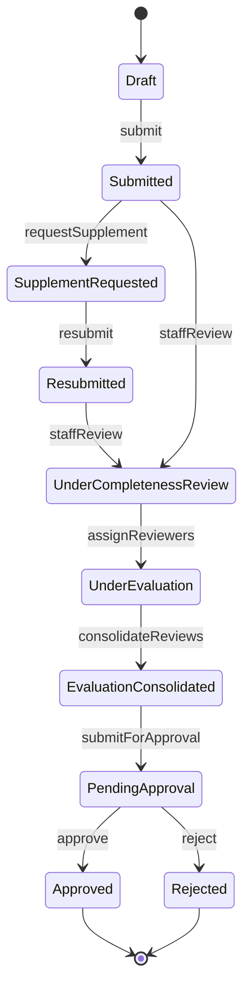
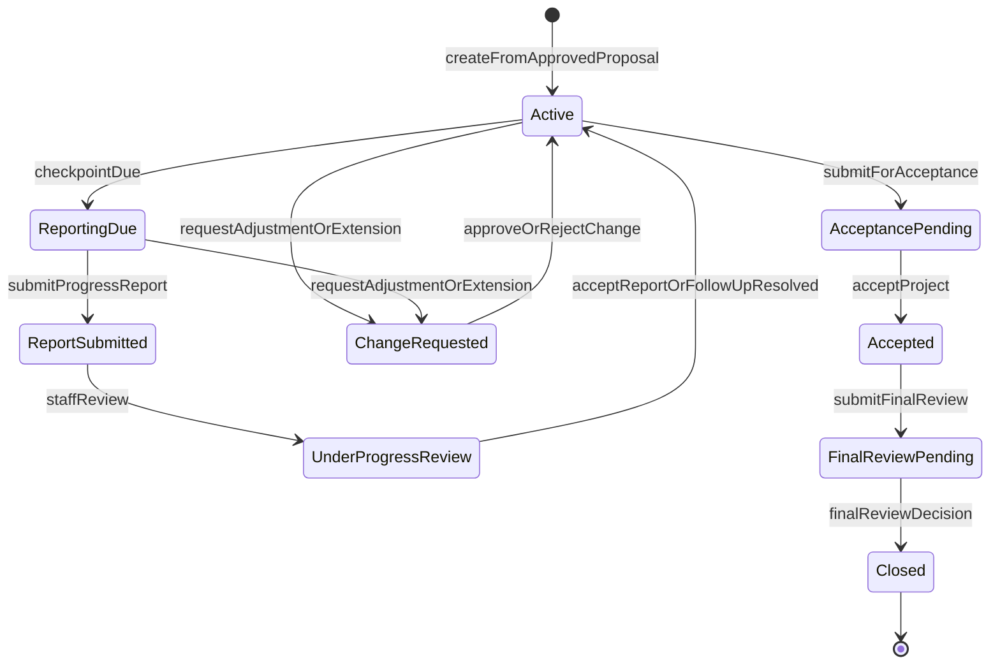
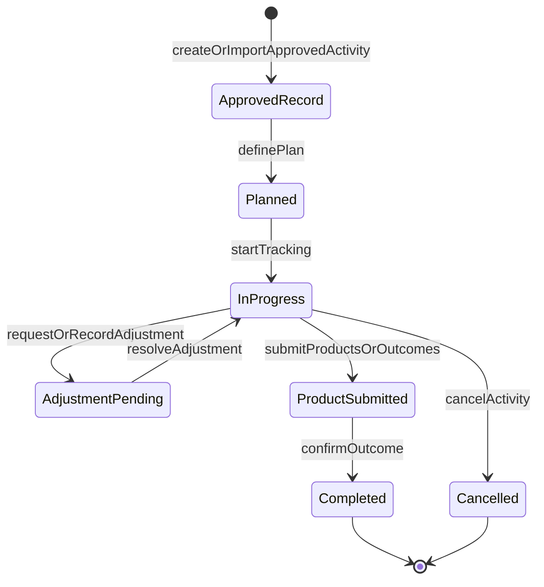
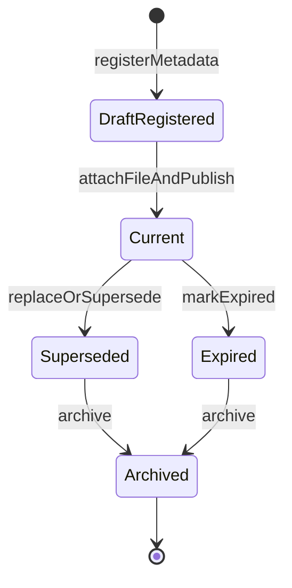
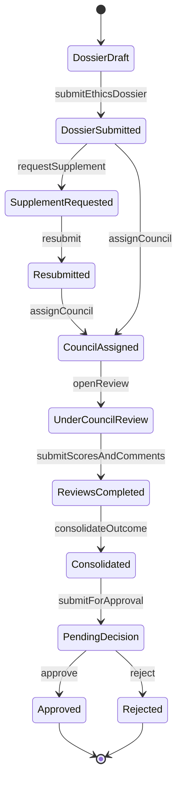
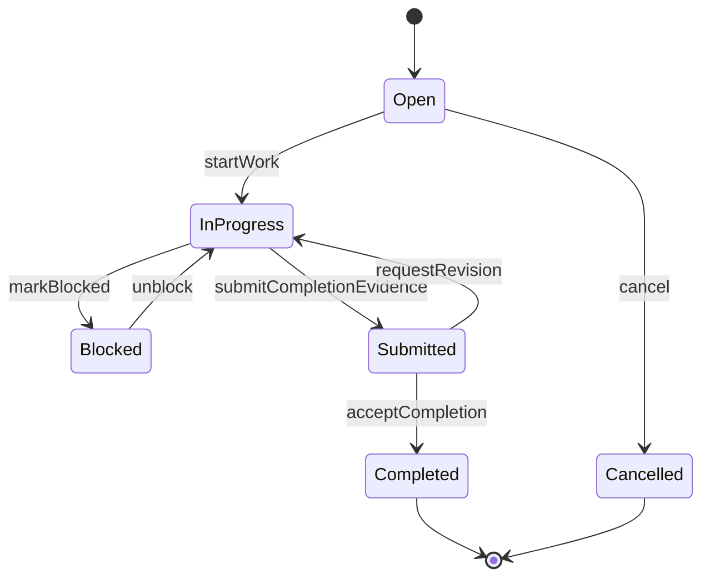

---
stepsCompleted:
  - 1
  - 2
  - 3
  - 4
  - 5
  - 6
  - 7
  - 8
inputDocuments:
  - "/Users/Super/DocManS/_bmad-output/prd.md"
  - "/Users/Super/DocManS/_bmad-output/project-context.md"
  - "/Users/Super/DocManS/_bmad-output/epics-and-stories.md"
  - "/Users/Super/DocManS/_bmad-output/detaiHVQY.md"
  - "/Users/Super/DocManS/docs/ux-design-guidelines.md"
workflowType: "architecture"
project_name: "DocManSystem"
user_name: "ThanhDaika"
date: "2026-04-27"
created: "2026-04-27T22:51:34+0700"
updated: "2026-06-16T00:00:00+0700"
lastStep: 8
status: "complete"
completedAt: "2026-04-27"
---

# Architecture Decision Document

_This document builds collaboratively through step-by-step discovery. Sections are appended as we work through each architectural decision together._

## Project Context Analysis

### Requirements Overview

**Functional Requirements:**
RTMS requires a full internal workflow platform rather than isolated CRUD modules. Architecturally, the functional scope clusters into identity and organization management, shared catalogs and configuration, proposal intake and approval, approved-project tracking, seminar and student research tracking, task management, related-document management, council and ethics management, researcher profile management, files/history/auditability, notifications/reminders/work queues, and dashboard/reporting. These requirements imply a modular backend with explicit domain boundaries and a frontend organized around workflow-heavy admin experiences.

**Non-Functional Requirements:**
Architecture must satisfy backend-enforced authorization, controlled workflow state transitions, auditability of critical actions, file traceability, responsive list/detail/form experiences, WCAG AA baseline accessibility, transactional integrity for key workflow actions, and maintainability of a modular monolith. Performance expectations are strongest on authenticated list views, dashboard widgets, search/filter flows, and common workflow actions.

**Scale & Complexity:**
The project is a high-complexity internal web platform because it combines multi-role workflows, multi-stage approval paths, organization-scoped data visibility, role-scoped dashboards, audit-log requirements, reminder jobs, file-management controls, and dense administrative UX.

- Primary domain: internal research administration web platform
- Complexity level: high
- Estimated architectural components: 24-30 major application modules plus shared platform capabilities

### Technical Constraints & Dependencies

- Architecture must use a modular monolith for phase 1
- Frontend stack is Next.js, React, TypeScript
- Backend stack is NestJS, TypeScript
- Database is PostgreSQL with Prisma
- Redis is required for cache, queue, and reminder/notification job orchestration
- MinIO is required for file storage via S3-compatible access
- Deployment must use Docker Compose and Nginx
- No microservices, Kubernetes, SSO/LDAP/OIDC/MFA, or Elasticsearch/OpenSearch in phase 1
- Design must preserve future extensibility for identity integration and broader institutional integrations

### Cross-Cutting Concerns Identified

- role-based authorization across all protected operations
- data-scope authorization by unit/organization
- state-based authorization for workflow actions
- audit-log capture and queryability for critical business events
- file permission enforcement and file metadata traceability
- reminder and notification consistency with business deadlines
- dashboard and reporting aggregation within current-user scope
- responsive institutional admin UI patterns
- validation, error handling, and workflow history visibility

## Starter Template Evaluation

### Primary Technology Domain

Full-stack internal web platform based on a monorepo workspace, with:

- Next.js frontend
- NestJS backend
- shared TypeScript packages for contracts, validation, and domain utilities
- modular-monolith runtime boundaries inside the backend

### Starter Options Considered

**Option 1: Nx workspace as the primary starter**

- Official support for both Next.js and NestJS in one workspace
- Strong fit for monorepo task orchestration, shared libraries, code generation, and project graph awareness
- Better long-term support for AI-assisted implementation consistency across frontend, backend, and shared packages
- Strong match for RTMS because the project needs one repository with multiple apps and shared domain packages, but not microservices

**Option 2: Plain pnpm workspace + create-next-app + nest new**

- Simpler conceptual setup
- More manual repository wiring, task orchestration, and shared-package discipline
- Higher risk of inconsistent structure across apps and packages
- Acceptable, but weaker than Nx for this project’s scale and governance complexity

**Option 3: Nest monorepo mode as the primary starter**

- Good only for Nest-centric backends
- Not an ideal foundation for a Next.js + NestJS full-stack workspace
- Rejected as primary starter for RTMS

### Selected Starter: Nx workspace with package workspaces enabled

**Rationale for Selection:**
Nx is the strongest fit for RTMS phase 1 because it supports a single repository, clear app/package separation, Next.js and NestJS coexistence, shared TypeScript libraries, and disciplined scaling without forcing microservices. It also aligns well with the project-context requirement that AI agents should implement consistently across stories and modules.

**Initialization Command:**

```bash
npx create-nx-workspace@latest docmansystem --template=nrwl/empty-template --workspaces
cd docmansystem
nx add @nx/next
nx add @nx/nest
```

### Architectural Decisions Provided by Starter

**Language & Runtime:**

- TypeScript-first workspace
- One JavaScript/TypeScript monorepo with workspace-level task orchestration

**Styling Solution:**

- Frontend app can follow Next.js + Tailwind direction already required by project context and UX guideline

**Build Tooling:**

- Nx task orchestration and caching
- Framework-specific build/dev/test commands managed consistently across apps and packages

**Testing Framework:**

- Workspace-friendly test orchestration across frontend, backend, and shared packages
- Good basis for story-sized testing and CI verification

**Code Organization:**

- Strong fit for `apps/` plus `packages/` or `apps/` plus `libs/` style organization
- Clear boundaries between deployable apps and shared libraries

**Development Experience:**

- Better shared tooling consistency than a hand-assembled workspace
- Good support for incremental scaling of repository structure without changing the deployment model

**Note:** Project initialization using this command should be the first implementation story.

## Core Architectural Decisions

### Decision Priority Analysis

**Critical Decisions (Block Implementation):**

- Use a modular monolith in one Nx workspace
- Separate deployable frontend and backend apps, with shared packages
- Use PostgreSQL as the system of record with Prisma migrations
- Use Redis for cache, queue, reminder jobs, and notification orchestration
- Use MinIO as the file object store
- Enforce role-based, data-scope, and state-based authorization in backend services
- Model proposal, approved-project, task, seminar/student research, related-document, council, and ethics workflows as explicit state machines
- Use Docker Compose and Nginx for phase 1 deployment
- Exclude microservices, Kubernetes, SSO, LDAP, OIDC, MFA, and Elasticsearch or OpenSearch from phase 1

**Important Decisions (Shape Architecture):**

- Use App Router-based Next.js admin application
- Use REST-style backend APIs with clear domain route groupings
- Keep business logic in NestJS services and domain-oriented modules
- Use shared packages for DTO contracts, validation schemas, permission primitives, and common types
- Use transactional workflow actions with audit-log capture as part of the application service layer
- Keep dashboard aggregation inside backend query and application services with scope-aware filtering

**Deferred Decisions (Post-MVP):**

- external identity integration
- search engine adoption beyond database-driven filtering
- deep analytics platforming
- event-driven decomposition into services
- cross-system workflow orchestration

### Data Architecture

- **Primary database:** PostgreSQL
- **ORM and migrations:** Prisma ORM 7.x with migration-driven schema evolution
- **Data modeling approach:** one relational database with clear schema ownership by domain module
- **Cache and jobs:** Redis for ephemeral caching, delayed reminders, notification dispatch, and queue-backed background work
- **Persistence rule:** PostgreSQL is the source of truth; Redis is auxiliary and disposable
- **Data integrity rule:** critical workflow actions must execute through transactional backend service flows
- **Schema boundary rule:** domain modules own their tables and relations; cross-module access goes through service and query boundaries, not ad hoc direct coupling

### Authentication & Security

- **Phase 1 authentication:** local application authentication with extensible adapter boundaries for future SSO
- **Authorization model:** role-based plus data-scope plus state-based authorization combined in backend guards, services, and policies
- **Session and security strategy:** authenticated web session or token-based app session, but always enforced server-side
- **Security middleware:** request validation, auth guards, permission checks, audit logging hooks, and rate protection for login-sensitive endpoints
- **Sensitive file rule:** file metadata visibility and file download access must be permission-checked every time
- **Failure posture:** fail closed when role, scope, assignment, or state context is ambiguous

### API & Communication Patterns

- **API style:** REST-style HTTP APIs grouped by domain module
- **Primary client communication:** frontend-to-backend HTTPS calls through Nginx reverse proxy
- **Route design convention:** `/api/v1/<domain-module>/...`
- **Error handling convention:** structured error envelope with machine-readable code, human-readable message, correlation metadata where useful, and validation details when applicable
- **Validation convention:** DTO validation at NestJS boundaries; business-rule validation inside application and domain services
- **Documentation approach:** OpenAPI generation from Nest where practical for internal developer clarity
- **Async communication:** background jobs for reminders, email notification dispatch, and heavier export and reporting work

### Frontend Architecture

- **Frontend runtime:** Next.js 16 App Router application
- **UI architecture:** admin-first route groups, shared layout shell, sidebar, topbar, and breadcrumb structure aligned to UX guideline
- **State management:** prefer server-driven data and route-local state first; introduce client state only where interaction complexity justifies it
- **Form architecture:** sectioned forms with validation, confirmation flows, and explicit workflow actions
- **Data-heavy screens:** tables on desktop, mobile-adapted list and card views, no full-page horizontal scrolling on mobile
- **Dashboard architecture:** role-aware server-backed dashboard sections with drill-down links into filtered operational lists

### Infrastructure & Deployment

- **Deployment model:** Docker Compose for phase 1 environments
- **Reverse proxy:** Nginx for routing, TLS termination, static asset serving policy, and upstream forwarding
- **Deployable units:** one frontend container, one backend container, one PostgreSQL service, one Redis service, one MinIO service, and one Nginx service
- **Environment strategy:** environment-variable driven configuration with separate settings for local, test, staging, and production-like deployments
- **Monitoring baseline:** structured app logs, error tracking, health checks, queue/job visibility, backup job visibility, and storage/database service monitoring
- **Scaling posture:** vertical-first and service-instance scaling within modular-monolith boundaries before any service decomposition

### Backup And Recovery

**Backup Ownership:**

- PostgreSQL is the source of truth for business state and must have scheduled logical backups plus tested restore procedures.
- MinIO stores business files and must have bucket/object backup or replication aligned with database backup windows.
- Redis is disposable supporting infrastructure for queues/cache; it does not replace PostgreSQL or MinIO backups.
- Application configuration and secrets must be recoverable from deployment-managed secret/config storage, not from source control.

**Minimum Phase 1 Policy:**

- PostgreSQL: nightly full logical backup for normal environments, with additional pre-deployment backup before risky migration windows.
- MinIO: nightly object backup or replication for buckets that contain business files, preserving object metadata needed by the files module.
- Prisma migrations: migration files are the recoverable schema history; every production-like restore must apply migrations and then validate application health checks.
- Backup retention: keep at least 7 daily restore points for phase 1 unless institutional policy requires longer retention.
- Restore testing: perform at least one restore rehearsal before pilot/UAT sign-off and repeat after major schema/storage changes.

**Recovery Targets:**

- Initial target RPO: 24 hours for phase 1 environments unless the academy defines a stricter operational policy.
- Initial target RTO: one business day for phase 1 recovery from backup, excluding infrastructure replacement lead time.
- Recovery verification must include database integrity checks, MinIO file access checks through the files module, login/auth checks, and smoke checks for proposal/project/task/dashboard workflows.

### Decision Impact Analysis

**Implementation Sequence:**

1. Initialize Nx workspace and create frontend and backend apps
2. Establish shared packages and repository conventions
3. Build authentication, organizations, roles, and permission primitives
4. Define Prisma schema foundations and migration workflow
5. Implement audit-log, file, notification, and job infrastructure
6. Implement proposal and approved-project domain modules with state machines
7. Implement seminar/student research, related-document, council/ethics, and researcher-profile modules
8. Implement task workflows, dashboards, reporting, and UX shells on top of stable domain APIs

**Cross-Component Dependencies:**

- authorization depends on users, roles, organizations, assignments, and workflow states
- dashboards depend on scope-aware query services across multiple modules
- notifications and reminders depend on workflow events, deadlines, and Redis-backed jobs
- file management depends on permission checks, domain ownership, and audit logging
- audit logging depends on consistent application service boundaries across all modules
- related documents depend on the files module for object storage and on domain modules for link validation
- council and ethics workflows depend on researcher profiles, user accounts, related documents, files, notifications, and audit logs

## Implementation Patterns & Consistency Rules

### Pattern Categories Defined

**Critical Conflict Points Identified:**
10 areas where AI agents could make incompatible choices:

- database naming
- Prisma model boundaries
- API route naming
- DTO and validation placement
- frontend feature organization
- error response format
- date and time representation
- authorization policy invocation
- audit-log capture pattern
- background job and notification trigger pattern

### Naming Patterns

**Database Naming Conventions:**

- Use `snake_case` for database tables, columns, foreign keys, indexes, and constraint names
- Use plural table names for aggregate collections, for example `users`, `research_proposals`, `approved_projects`, `progress_reports`
- Use `<related_entity>_id` for foreign keys, for example `organization_id`, `proposal_id`, `reviewer_id`
- Use explicit join-table names such as `proposal_reviewers` or `project_members`
- Prisma model names remain `PascalCase`, but `@map` and `@@map` should preserve `snake_case` database names when needed

**API Naming Conventions:**

- Use plural resource-oriented route groups, for example `/api/v1/users`, `/api/v1/research-proposals`, `/api/v1/tasks`
- Use kebab-case for route segments, not camelCase
- Use query parameters in `camelCase` at HTTP contract level for frontend friendliness
- Use explicit action subpaths for workflow actions, for example:
  - `POST /api/v1/research-proposals/:id/submit`
  - `POST /api/v1/research-proposals/:id/request-supplement`
  - `POST /api/v1/approved-projects/:id/request-adjustment`

**Code Naming Conventions:**

- Use `PascalCase` for React components, NestJS classes, Prisma-facing domain types, and DTO classes
- Use `camelCase` for functions, variables, object fields, and TypeScript properties
- Use kebab-case for file names except where framework conventions strongly require otherwise
- Use explicit domain names instead of generic names such as `service`, `manager`, or `helper`

### Structure Patterns

**Project Organization:**

- Use one Nx workspace
- Use `apps/` for deployable applications
- Use `packages/` for shared code
- Organize both frontend and backend primarily by domain feature, not only by technical type
- Keep cross-cutting shared packages minimal and intentional

**Backend Structure Pattern:**

- Each domain module owns:
  - controller layer
  - application and service layer
  - domain rules and workflow transitions
  - persistence mapping or repository access
  - DTOs and policy hooks
- Do not place business logic in controllers
- Do not let one domain module reach directly into another module’s internal persistence layer without a defined boundary

**Frontend Structure Pattern:**

- Organize UI by feature area aligned to domain modules
- Keep shared UI primitives separate from feature-specific screens
- Keep route-level server data loading close to route boundaries
- Keep reusable form, table, and dashboard primitives in shared UI packages only when reuse is real

**Test Placement Pattern:**

- Prefer co-located unit tests near the implementation they verify
- Keep integration and end-to-end tests in clearly named higher-level test locations
- Ensure backend authorization, workflow, audit-log, and file-access tests are easy to find by feature

### Format Patterns

**API Response Formats:**

- Success responses should default to direct resource or list payloads unless pagination or metadata is needed
- Paginated list responses should use a consistent envelope such as:
  - `items`
  - `page`
  - `pageSize`
  - `total`
- Workflow action responses should include the updated resource state or a clearly typed action result, not ambiguous booleans only

**Error Response Structure:**

- Use a consistent error envelope:
  - `code`
  - `message`
  - `details` when validation or field-level context exists
  - `traceId` or correlation id when available
- Distinguish user-correctable validation errors from authorization, not-found, conflict, and server errors

**Date And Time Format:**

- Use ISO 8601 strings at API boundaries
- Store timestamps in UTC
- Convert for display in the UI layer only
- Do not mix timestamps, locale strings, and custom date formats across modules

### Communication Patterns

**Authorization Pattern:**

- Every protected backend action must evaluate:
  - authenticated actor
  - role
  - organization or data scope
  - state-based permission if applicable
- Authorization logic must not live only in decorators or only in frontend guards; it must be enforceable in backend application flow

**Audit-Log Pattern:**

- Audit-log capture must happen as part of the same application use case that changes business state
- Log structure should consistently capture:
  - actor
  - action
  - target type
  - target id
  - timestamp
  - relevant before and after or contextual metadata
- Do not leave audit logging to ad hoc controller code

**Notification And Job Pattern:**

- Business actions emit internal application events or invoke explicit notification services
- Reminder and notification jobs must use consistent payload structures and idempotency keys where applicable
- Redis-backed jobs must be used for delayed or retryable background work, not for source-of-truth state

### Process Patterns

**Validation Pattern:**

- Use DTO validation for boundary validation
- Use application and domain validation for workflow and business-rule validation
- Frontend validation improves UX but never replaces backend validation

**Loading State Pattern:**

- Frontend should treat loading, empty, success, and error states as first-class states for all data-heavy screens
- Long-running exports or workflow actions should show explicit progress or completion signaling where relevant

**Workflow Transition Pattern:**

- Proposal, approved-project, task, seminar/student research, related-document, council, and ethics-dossier state transitions must be executed through named application actions
- Direct arbitrary state mutation is forbidden
- Transition guards must be centralized and testable
- Each workflow-owning module must expose transition functions that perform authorization, validation, persistence, audit logging, and notification hooks in one application flow where applicable

## Workflow State Machine Diagrams

These diagrams define the target architecture-level state boundaries. Story implementations may introduce only the subset required by the active story, but must not bypass these controlled transition shapes.

### Proposal Intake And Approval State Machine



### Approved Project State Machine



### Seminar And Student Research State Machine



### Related Document Lifecycle State Machine



### Council And Ethics State Machine



### Task State Machine



### Enforcement Guidelines

**All AI Agents MUST:**

- preserve modular domain boundaries
- use the agreed naming conventions for database, API, and code
- enforce authorization, audit logging, and workflow transition rules in backend application flow
- keep API contracts and error envelopes consistent
- avoid introducing new cross-cutting patterns without updating architecture documentation

**Pattern Enforcement:**

- architecture review checks repository placement, naming, API format, and boundary ownership
- PR review checks authorization, audit-log, workflow-state, and file-access consistency
- story validation checks whether new code follows existing package, module, DTO, and route patterns

### Pattern Examples

**Good Examples:**

- `POST /api/v1/research-proposals/:id/submit`
- `research_proposals` table with Prisma model `ResearchProposal`
- `RequestSupplementDto` in the proposal module
- `ResearchProposalService.requestSupplement(...)` performs authorization, state transition, persistence, and audit logging in one application flow

**Anti-Patterns:**

- generic routes such as `/api/doAction`
- controller-owned business rules
- mixed `snake_case` and `camelCase` database columns without mapping discipline
- frontend-only permission checks for protected actions
- direct state edits that bypass transition rules
- notification side effects scattered across controllers and UI code

## Project Structure & Boundaries

### Complete Project Directory Structure

```text
docmansystem/
├── README.md
├── package.json
├── pnpm-workspace.yaml
├── nx.json
├── tsconfig.base.json
├── .gitignore
├── .env.example
├── docker-compose.yml
├── nginx/
│   ├── nginx.conf
│   └── conf.d/
│       └── rtms.conf
├── apps/
│   ├── web/
│   │   ├── project.json
│   │   ├── next.config.ts
│   │   ├── tsconfig.json
│   │   ├── public/
│   │   │   └── assets/
│   │   └── src/
│   │       ├── app/
│   │       │   ├── (auth)/
│   │       │   ├── (dashboard)/
│   │       │   ├── research-proposals/
│   │       │   ├── approved-projects/
│   │       │   ├── seminars/
│   │       │   ├── student-research/
│   │       │   ├── related-documents/
│   │       │   ├── councils/
│   │       │   ├── ethics-dossiers/
│   │       │   ├── researcher-profiles/
│   │       │   ├── tasks/
│   │       │   ├── reports/
│   │       │   ├── settings/
│   │       │   ├── layout.tsx
│   │       │   ├── page.tsx
│   │       │   └── globals.css
│   │       ├── features/
│   │       │   ├── auth/
│   │       │   ├── dashboard/
│   │       │   ├── research-proposals/
│   │       │   ├── proposal-evaluations/
│   │       │   ├── approvals/
│   │       │   ├── approved-projects/
│   │       │   ├── progress-reports/
│   │       │   ├── adjustment-requests/
│   │       │   ├── acceptance/
│   │       │   ├── seminars/
│   │       │   ├── student-research/
│   │       │   ├── related-documents/
│   │       │   ├── councils/
│   │       │   ├── ethics-dossiers/
│   │       │   ├── council-evaluations/
│   │       │   ├── researcher-profiles/
│   │       │   ├── tasks/
│   │       │   ├── notifications/
│   │       │   ├── files/
│   │       │   └── reports/
│   │       ├── components/
│   │       │   ├── ui/
│   │       │   ├── layout/
│   │       │   ├── tables/
│   │       │   ├── forms/
│   │       │   ├── status/
│   │       │   ├── timeline/
│   │       │   └── charts/
│   │       ├── lib/
│   │       │   ├── api-client/
│   │       │   ├── auth/
│   │       │   ├── permissions/
│   │       │   ├── formatting/
│   │       │   └── utils/
│   │       ├── hooks/
│   │       └── middleware.ts
│   └── api/
│       ├── project.json
│       ├── nest-cli.json
│       ├── tsconfig.app.json
│       ├── tsconfig.spec.json
│       ├── prisma/
│       │   ├── schema.prisma
│       │   ├── migrations/
│       │   └── seed/
│       └── src/
│           ├── main.ts
│           ├── app.module.ts
│           ├── config/
│           ├── common/
│           │   ├── auth/
│           │   ├── authorization/
│           │   ├── dto/
│           │   ├── exceptions/
│           │   ├── filters/
│           │   ├── guards/
│           │   ├── interceptors/
│           │   ├── pipes/
│           │   ├── logging/
│           │   └── utils/
│           ├── infrastructure/
│           │   ├── prisma/
│           │   ├── redis/
│           │   ├── minio/
│           │   ├── mail/
│           │   ├── queue/
│           │   └── scheduler/
│           ├── modules/
│           │   ├── auth/
│           │   ├── users/
│           │   ├── roles/
│           │   ├── organizations/
│           │   ├── catalogs/
│           │   ├── research-proposals/
│           │   ├── proposal-intake-periods/
│           │   ├── proposal-evaluations/
│           │   ├── approvals/
│           │   ├── approved-projects/
│           │   ├── progress-milestones/
│           │   ├── progress-reports/
│           │   ├── adjustment-requests/
│           │   ├── acceptance/
│           │   ├── final-review/
│           │   ├── seminars/
│           │   ├── student-research/
│           │   ├── related-documents/
│           │   ├── councils/
│           │   ├── ethics-dossiers/
│           │   ├── council-evaluations/
│           │   ├── researcher-profiles/
│           │   ├── tasks/
│           │   ├── notifications/
│           │   ├── files/
│           │   ├── audit-logs/
│           │   ├── dashboard/
│           │   └── reports/
│           └── jobs/
│               ├── reminders/
│               ├── notifications/
│               └── exports/
├── packages/
│   ├── contracts/
│   │   ├── src/
│   │   │   ├── api/
│   │   │   ├── dto/
│   │   │   └── enums/
│   ├── domain-types/
│   │   └── src/
│   ├── validation/
│   │   └── src/
│   ├── permissions/
│   │   └── src/
│   ├── ui-tokens/
│   │   └── src/
│   ├── eslint-config/
│   └── tsconfig/
├── tools/
│   ├── scripts/
│   └── generators/
└── tests/
    ├── e2e/
    │   ├── web/
    │   └── api/
    ├── integration/
    │   └── api/
    └── fixtures/
```

### Architectural Boundaries

**API Boundaries:**

- `apps/api` is the only service that owns business-state mutation and protected workflow decisions
- `apps/web` never bypasses the API to access persistence directly
- Public route surface is limited to authenticated internal APIs under `/api/v1`
- Domain routes are grouped by module and workflow action

**Component Boundaries:**

- `apps/web/src/features/*` owns feature-specific UI and orchestration
- `apps/web/src/components/ui/*` owns reusable design primitives only
- `apps/web/src/components/layout/*` owns shell and navigation structure
- Dashboard widgets, proposal forms, seminar/student research views, related-document views, council/ethics views, researcher-profile views, task views, and timeline/history views live in feature modules, not generic shared buckets

**Service Boundaries:**

- Each backend domain module owns its own controller, application service, policy checks, and persistence integration
- Cross-module reads should prefer query and application services
- Cross-module writes must go through explicit service APIs or orchestration flows, not direct repository reach-through

**Data Boundaries:**

- One PostgreSQL database, but clear module ownership by table and relation
- Prisma schema is physically centralized but logically partitioned by domain comment blocks and ownership rules
- Redis never becomes source-of-truth persistence
- MinIO object storage is accessed only through the files module and supporting infrastructure adapters

### Requirements To Structure Mapping

**Feature Mapping:**

- Research proposal intake and approval → `research-proposals`, `proposal-intake-periods`, `proposal-evaluations`, `approvals`, `files`, `audit-logs`, `notifications`
- Approved project tracking → `approved-projects`, `progress-milestones`, `progress-reports`, `adjustment-requests`, `acceptance`, `final-review`, `files`, `audit-logs`
- Seminar and student research tracking → `seminars`, `student-research`, `related-documents`, `files`, `audit-logs`, `notifications`, `dashboard`
- Related-document management → `related-documents`, `files`, `audit-logs`, plus link validation through target domain services
- Council and ethics management → `councils`, `ethics-dossiers`, `council-evaluations`, `related-documents`, `researcher-profiles`, `files`, `audit-logs`, `notifications`
- Researcher profile management → `researcher-profiles`, `users`, `organizations`, `catalogs`, `audit-logs`, plus participation links to operational modules
- Task management → `tasks`, `notifications`, `audit-logs`, `dashboard`
- Role-based dashboard and reporting → `dashboard`, `reports`, plus read-side queries from all operational modules including seminars, student research, related documents, councils, ethics dossiers, and researcher profiles

**Cross-Cutting Concerns:**

- Authentication and sessions → `auth`, shared guards and strategies, frontend auth lib
- Password change/reset → `auth`, `users`, audit logging, backend credential policy utilities
- Role and scope permissions → `roles`, `organizations`, shared `permissions` package, backend authorization layer
- File management → `files` module plus `infrastructure/minio`
- Audit logging → `audit-logs` module plus common logging hooks
- Reminder and notification jobs → `notifications` module plus `jobs/reminders` plus Redis queue and scheduler
- Shared DTOs, enums, and contracts → `packages/contracts`, `packages/domain-types`, `packages/validation`

### ER Diagram

This ER diagram is intentionally architecture-level. It shows ownership and major relationships; detailed fields and constraints belong in Prisma migrations and story implementation notes.

```mermaid
erDiagram
    ORGANIZATIONS ||--o{ USERS : scopes
    USERS ||--o{ USER_ROLES : has
    ROLES ||--o{ USER_ROLES : assigned
    USERS ||--o| RESEARCHER_PROFILES : may_link
    ORGANIZATIONS ||--o{ RESEARCHER_PROFILES : owns

    PROPOSAL_INTAKE_PERIODS ||--o{ RESEARCH_PROPOSALS : accepts
    RESEARCH_PROPOSALS ||--o{ PROPOSAL_MEMBERS : has
    RESEARCHER_PROFILES ||--o{ PROPOSAL_MEMBERS : participates
    RESEARCH_PROPOSALS ||--o{ PROPOSAL_SUPPLEMENT_REQUESTS : has
    RESEARCH_PROPOSALS ||--o{ PROPOSAL_EVALUATION_ASSIGNMENTS : assigns
    PROPOSAL_EVALUATION_ASSIGNMENTS ||--o{ PROPOSAL_EVALUATIONS : produces
    RESEARCH_PROPOSALS ||--o{ PROPOSAL_APPROVAL_DECISIONS : receives
    RESEARCH_PROPOSALS ||--o| APPROVED_PROJECTS : becomes

    APPROVED_PROJECTS ||--o{ PROJECT_MEMBERS : has
    RESEARCHER_PROFILES ||--o{ PROJECT_MEMBERS : participates
    APPROVED_PROJECTS ||--o{ PROGRESS_MILESTONES : plans
    PROGRESS_MILESTONES ||--o{ PROGRESS_REPORTS : receives
    APPROVED_PROJECTS ||--o{ ADJUSTMENT_REQUESTS : changes
    APPROVED_PROJECTS ||--o{ ACCEPTANCE_REVIEWS : closes
    APPROVED_PROJECTS ||--o{ FINAL_REVIEW_DECISIONS : finalizes

    SEMINARS ||--o{ SEMINAR_PARTICIPANTS : has
    STUDENT_RESEARCH_ACTIVITIES ||--o{ STUDENT_RESEARCH_PARTICIPANTS : has
    RESEARCHER_PROFILES ||--o{ SEMINAR_PARTICIPANTS : participates
    RESEARCHER_PROFILES ||--o{ STUDENT_RESEARCH_PARTICIPANTS : supervises_or_participates

    COUNCILS ||--o{ COUNCIL_MEMBERS : has
    RESEARCHER_PROFILES ||--o{ COUNCIL_MEMBERS : serves
    ETHICS_DOSSIERS ||--o{ COUNCIL_EVALUATION_ASSIGNMENTS : assigns
    COUNCIL_EVALUATION_ASSIGNMENTS ||--o{ COUNCIL_EVALUATIONS : produces
    ETHICS_DOSSIERS ||--o{ ETHICS_SUPPLEMENT_REQUESTS : has
    ETHICS_DOSSIERS ||--o{ COUNCIL_DECISIONS : receives
    COUNCILS ||--o{ ETHICS_DOSSIERS : reviews

    RELATED_DOCUMENTS ||--o{ RELATED_DOCUMENT_LINKS : links
    FILE_RECORDS ||--o{ RELATED_DOCUMENTS : stores_document_file
    FILE_RECORDS ||--o{ RESEARCH_PROPOSALS : attaches_to
    FILE_RECORDS ||--o{ APPROVED_PROJECTS : attaches_to
    FILE_RECORDS ||--o{ ETHICS_DOSSIERS : attaches_to

    TASKS ||--o{ TASK_ASSIGNMENTS : has
    USERS ||--o{ TASK_ASSIGNMENTS : assigned
    AUDIT_LOGS }o--|| USERS : actor
    NOTIFICATIONS }o--|| USERS : recipient
```



### Core Domain Entities

**Identity & Governance:**

- User
- Role
- Permission
- Organization
- UserRoleAssignment
- UserOrganizationScope
- ResearcherProfile

**Proposal Lifecycle:**

- ProposalIntakePeriod
- ResearchProposal
- ProposalMember
- ProposalAttachment
- ProposalSupplementRequest
- ProposalEvaluationAssignment
- ProposalEvaluation
- ProposalApprovalDecision

**Approved Project Lifecycle:**

- ApprovedProject
- ProjectMember
- ProgressMilestone
- ProgressReport
- ProjectAttachment
- AdjustmentRequest
- AcceptanceReview
- FinalReviewDecision

**Seminar And Student Research:**

- Seminar
- SeminarParticipant
- StudentResearchActivity
- StudentResearchParticipant
- ActivityMilestone
- ActivityAdjustment
- ActivityProduct

**Related Documents:**

- RelatedDocument
- RelatedDocumentLink
- RelatedDocumentVersion
- RelatedDocumentReplacement

**Council And Ethics:**

- Council
- CouncilMember
- EthicsDossier
- EthicsSupplementRequest
- CouncilEvaluationAssignment
- CouncilEvaluation
- CouncilDecision

**Task & Support:**

- Task
- TaskAssignment
- Notification
- ReminderJob
- AuditLog
- ReportDefinition
- ExportJob
- FileRecord

### Database Schema Boundaries

**Auth / Governance Ownership:**

- `users`
- `roles`
- `permissions`
- `user_roles`
- `organizations`
- `user_organization_scopes`
- `password_reset_tokens`

**Researcher Profile Ownership:**

- `researcher_profiles`
- `researcher_profile_user_links`
- `researcher_expertise_keywords`
- `researcher_participation_links`

**Proposal Domain Ownership:**

- `proposal_intake_periods`
- `research_proposals`
- `proposal_members`
- `proposal_attachments`
- `proposal_supplement_requests`
- `proposal_evaluation_assignments`
- `proposal_evaluations`
- `proposal_approval_decisions`

**Approved Project Domain Ownership:**

- `approved_projects`
- `project_members`
- `progress_milestones`
- `progress_reports`
- `project_attachments`
- `adjustment_requests`
- `acceptance_reviews`
- `final_review_decisions`

**Seminar And Student Research Domain Ownership:**

- `seminars`
- `seminar_participants`
- `student_research_activities`
- `student_research_participants`
- `activity_milestones`
- `activity_adjustments`
- `activity_products`

**Related Document Domain Ownership:**

- `related_documents`
- `related_document_links`
- `related_document_versions`
- `related_document_replacements`

**Council And Ethics Domain Ownership:**

- `councils`
- `council_members`
- `ethics_dossiers`
- `ethics_dossier_attachments`
- `ethics_supplement_requests`
- `council_evaluation_assignments`
- `council_evaluations`
- `council_decisions`

**Operational Support Ownership:**

- `tasks`
- `task_assignments`
- `notifications`
- `audit_logs`
- `file_records`
- `export_jobs`

### Integration Points

**Internal Communication:**

- frontend to API via HTTP
- domain module to domain module via explicit service and query boundaries
- workflow side effects to notifications, audit, and files via application orchestration
- async reminders and exports via Redis-backed jobs

**External Integrations:**

- MinIO for object storage
- SMTP or mail provider for email notifications
- Nginx reverse proxy in front of web and API
- future identity integration reserved behind auth boundary

**Data Flow:**

- user action enters web route
- web calls backend API
- backend validates DTO plus permission plus state transition
- backend persists via Prisma and PostgreSQL
- backend emits audit, notification, and file side effects
- background jobs handle delayed reminders, email dispatch, and heavy exports

### File Organization Patterns

**Configuration Files:**

- workspace-level config at root
- app-specific runtime config inside each app
- infra config under `nginx/`, `docker-compose.yml`, and app config modules

**Source Organization:**

- apps for deployables, packages for shared code
- backend modules by domain
- frontend features by domain
- no generic dumping grounds for business logic

**Test Organization:**

- unit tests close to implementation
- integration tests grouped under backend integration suites
- e2e tests split by web and api behavior
- fixtures centralized under `tests/fixtures`

**Asset Organization:**

- static public assets under `apps/web/public/assets`
- no business file uploads stored in repo
- runtime uploads only in MinIO via files module

### Development Workflow Integration

**Development Server Structure:**

- Nx runs web and api as separate apps in one workspace
- shared packages rebuilt or watched through workspace tooling
- local infra services via Docker Compose when needed

**Build Process Structure:**

- web and api build independently
- shared packages versioned inside workspace
- Prisma generation and migrations remain backend-owned steps

**Deployment Structure:**

- Docker Compose orchestrates frontend, API, PostgreSQL, Redis, MinIO, and Nginx
- Nginx routes browser traffic to web and API paths
- storage, queue, and database remain internal supporting services for the modular monolith

## Architecture Validation Results

### Coherence Validation ✅

**Decision Compatibility:**
The chosen stack and architectural decisions are compatible. Nx workspace, Next.js frontend, NestJS backend, PostgreSQL with Prisma, Redis-backed jobs, MinIO object storage, Nginx reverse proxy, and Docker Compose deployment all fit a phase 1 modular monolith without forcing premature service decomposition.

**Pattern Consistency:**
The implementation patterns reinforce the architecture rather than contradict it. Naming, routing, DTO validation, authorization enforcement, audit-log capture, background job handling, and workflow transition patterns are aligned with the chosen stack and domain rules.

**Structure Alignment:**
The project structure supports the architectural decisions. Apps, packages, backend domain modules, and infrastructure adapters are separated clearly enough to preserve modularity while still supporting one deployable product architecture.

### Requirements Coverage Validation ✅

**Feature Coverage:**
The core modules from the PRD and `detaiHVQY.md` are represented structurally and logically:

- research proposal intake and approval
- approved project tracking
- seminar and student research tracking
- task management
- role-based dashboard and reports
- related-document management
- council and ethics management
- researcher profile management

**Functional Requirements Coverage:**
The architecture supports identity and governance, catalogs, researcher profiles, workflows, files, related documents, council/ethics operations, notifications, reminders, dashboards, reporting, and auditability.

**Non-Functional Requirements Coverage:**
The architecture addresses performance-sensitive views, backend-first security, workflow integrity, accessibility constraints, modular maintainability, and deployment simplicity for phase 1.

### Implementation Readiness Validation ✅

**Decision Completeness:**
Critical implementation-blocking decisions have been made:

- workspace model
- frontend and backend stack
- persistence model
- file storage model
- queue and cache model
- deployment model
- authorization and governance approach

**Structure Completeness:**
The repository structure, module structure, shared package structure, and integration boundaries are defined clearly enough for implementation planning.

**Pattern Completeness:**
The architecture specifies enough conventions to reduce drift between agents in naming, API design, validation, workflow transitions, error handling, and job orchestration.

### Gap Analysis Results

**Critical Gaps:** None

**Important Gaps:**

- API conventions can be made sharper for filtering, pagination, and workflow-action endpoints

**Nice-to-Have Gaps:**

- example request and response envelopes for common list and action endpoints
- explicit observability event and log taxonomy
- example permission matrix excerpts for key roles

### Validation Issues Addressed

- The architecture preserves modular-monolith constraints and avoids phase 1 scope violations
- No contradictory technology choices were found
- No structural conflicts were found between backend module ownership and frontend feature organization

### Architecture Completeness Checklist

**✅ Requirements Analysis**

- [x] Project context thoroughly analyzed
- [x] Scale and complexity assessed
- [x] Technical constraints identified
- [x] Cross-cutting concerns mapped

**✅ Architectural Decisions**

- [x] Critical decisions documented
- [x] Technology stack fully specified
- [x] Integration patterns defined
- [x] Performance and security considerations addressed

**✅ Implementation Patterns**

- [x] Naming conventions established
- [x] Structure patterns defined
- [x] Communication patterns specified
- [x] Process patterns documented

**✅ Project Structure**

- [x] Complete directory structure defined
- [x] Component boundaries established
- [x] Integration points mapped
- [x] Requirements-to-structure mapping completed

### Architecture Readiness Assessment

**Overall Status:** READY FOR IMPLEMENTATION

**Confidence Level:** High

**Key Strengths:**

- strong modular boundaries
- explicit governance and authorization model
- practical phase 1 deployment shape
- AI-agent-friendly implementation rules
- good alignment with PRD and project context

**Areas for Future Enhancement:**

- compact API contract conventions subsection

### Implementation Handoff

**AI Agent Guidelines:**

- follow module ownership boundaries exactly
- enforce authorization, audit-log, and workflow-state rules in backend application flow
- keep frontend aligned to feature boundaries and institutional admin UX rules
- use shared packages for contracts, validation, and permission primitives instead of duplicating them

**First Implementation Priority:**
Initialize the Nx workspace and establish the baseline repository, shared packages, backend governance modules, and infrastructure adapters before feature delivery begins.
