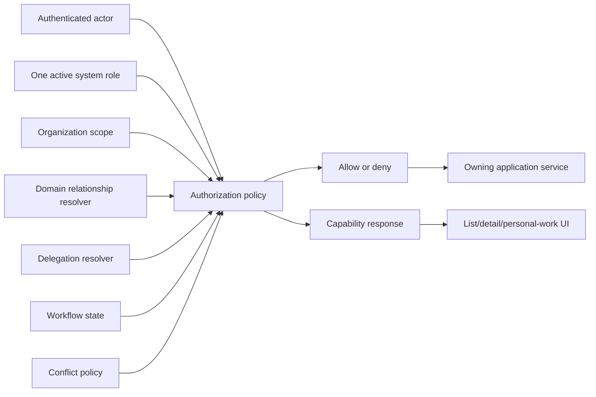

# Architecture Spine — DocManSystem Record-Scoped Authorization

## Reality Baseline

This is the adopted target contract for new and migrated authorization work.
`[ADOPTED]` means accepted from the named planning sources, not already
implemented. The current code still contains multi-role/global business-role
authorization and proposal-specific seams; the foundation migration must
reconcile those seams before dependent stories may rely on this spine.

## Design Paradigm

Policy-enforced modular monolith. Source domains own typed record
relationships and state. One shared authorization policy composes those
domain-owned facts and returns a decision plus a capability projection.
Frontend code, controllers, jobs, exports, and file endpoints consume that
contract and never recreate it.



## Invariants & Rules

### AD-1 — Account Role Cardinality [ADOPTED]

- **Binds:** auth, users, navigation, seed data
- **Prevents:** stacked global PI/member/secretary/reviewer authority
- **Rule:** each account has exactly one active system role; business roles are
  typed record relationships

### AD-2 — Complete Authorization Context [ADOPTED]

- **Binds:** every protected query, mutation, export, file action, job, and
  notification
- **Prevents:** role-only or scope-only permission decisions
- **Rule:** evaluate system role, organization scope, active record
  relationships, assignment scope, valid delegation, workflow state, and
  conflict policy; each applicable resolver returns `resolved(value)`,
  `resolved(empty)`, or `unresolved/error`, while inapplicable dimensions return
  `not-applicable`; only unresolved, failed, stale, or ambiguous applicable
  context fails closed

### AD-3 — Deny Precedence [ADOPTED]

- **Binds:** policy evaluation and capability projection
- **Prevents:** highest-role, role-union, or delegation bypass
- **Rule:** all denials override additive allows; when several apply, every
  policy entry point uses the complete ordered
  `AuthorizationDecisionCodeV1` registry in `AUTHORIZATION-CONTRACTS.md`,
  including unresolved, stale, ambiguous, unknown-contract, and context-version
  failures

### AD-4 — Domain-Owned Relationships [ADOPTED]

- **Binds:** proposal, project, council, ethics, review, task, and researcher
  modules
- **Prevents:** one generic participation table erasing domain conflict rules
- **Rule:** source domains own typed relationships and lifecycle; researcher
  profiles own shared identity only; authorized history is an authorized
  query-on-read aggregation in phase 1 and is never a mutation or authorization
  source of truth

### AD-5 — Explicit Delegation [ADOPTED]

- **Binds:** governance, audit, source-domain action policies
- **Prevents:** informal act-on-behalf access
- **Rule:** a valid grant is initiated by the current action holder, approved
  by authorized scientific-management staff, active, unrevoked, within its
  validity interval, and backed by current source authority; exact-match
  versioned action identifiers and the record-bounded `DelegationGrantV1`
  envelope are required; its organization scope, approval separation, and
  non-delegable registry are defined by `AUTHORIZATION-CONTRACTS.md`

### AD-6 — Server Capability Contract [ADOPTED]

- **Binds:** API DTOs, web UI, tests
- **Prevents:** frontend permission inference and unexplained hidden actions
- **Rule:** one versioned shared DTO states only the viewer's
  security-relevant relationships, allowed actions, blocked actions, stable
  codes, reasons, and evaluated context version; unknown versions/codes fail
  closed, and mutations re-evaluate authoritative context in the same
  transaction or against validated context versions

### AD-7 — Conflict-Safe Personal Work [ADOPTED]

- **Binds:** personal work hub, dashboards, work queues
- **Prevents:** cross-module count leakage and conflicted approval items
- **Rule:** phase-1 personal work queries source-domain authorized contracts at
  read time, excludes inaccessible items from results and counts, and excludes
  conflicted items from actionable counts/enabled queues while keeping a
  `PersonalWorkEntryV1` blocked presentation; any enabled-source failure fails
  the whole response as defined by `AUTHORIZATION-CONTRACTS.md`

### AD-8 — Dependency Ordering [ADOPTED]

- **Binds:** epic and story sequencing
- **Prevents:** aggregate features depending on future domain contracts
- **Rule:** deliver identity/participation foundations before
  conflict-sensitive council work; add file, reminder, search, dashboard,
  report, and personal-hub integrations only after each source domain exists

### AD-9 — Canonical Lifecycle Time [ADOPTED]

- **Binds:** participation, assignment, council membership, delegation, jobs,
  audit, and tests
- **Prevents:** different authority at time-zone or end-date boundaries
- **Rule:** use the database server's UTC instant and half-open intervals
  `effectiveFrom <= asOf < effectiveUntil`, with null end unbounded; revocation
  wins immediately, history is not physically deleted, and overlapping active
  same-type relations follow the closed multiplicity/composition registry;
  every resolver receives the one request-wide `asOf` from
  `AuthorizationContextV1`

### AD-10 — Shared Contract Registries [ADOPTED]

- **Binds:** `packages/permissions`, source domains, API clients, audit
- **Prevents:** incompatible action names, denial codes, capability shapes, and
  audit interpretations
- **Rule:** `PermissionActionV1`, `AuthorizationDecisionCodeV1`,
  `ViewerAuthorizationV1`, `PersonalWorkEntryV1`, and `AuthorizationAuditV1`
  are the normative schemas and registries in `AUTHORIZATION-CONTRACTS.md`,
  owned executably by `packages/permissions`; its canonical fixtures and
  compatibility rules bind every producer and consumer

### AD-11 — Restricted Review Disclosure [ADOPTED]

- **Binds:** lists, details, files, exports, notifications, dashboards, history,
  proposal, review, council, and ethics modules
- **Prevents:** leaking reviewer identities or internal evaluation material
- **Rule:** before the configured disclosure state, PI, co-investigator,
  members, and secretaries receive no reviewer identity, raw score, comment, or
  consolidation data; every audience, surface, field response, and
  `PublishedReviewSummaryV1` follows the matrix in
  `AUTHORIZATION-CONTRACTS.md`

### AD-12 — Brownfield Authorization Migration [ADOPTED]

- **Binds:** Prisma role data, seeds, auth/session DTOs, shared permission
  types, navigation, current permission seams, and dependent stories
- **Prevents:** old global roles and a new record policy granting authority in
  parallel
- **Rule:** the foundation work chooses one system-role source of truth,
  migrates legacy PI/reviewer/council accounts to a canonical system role plus
  typed record relationships, enforces one active system role at persistence
  and service boundaries, and consolidates existing permission seams before
  dependent modules are implemented

### AD-13 — Authoritative Commands and Jobs [ADOPTED]

- **Binds:** mutations, delayed jobs, reminders, notifications, exports, audit
- **Prevents:** time-of-check/time-of-use grants and stale queued authority
- **Rule:** owning services authorize and mutate in one transaction or validate
  `ContextVersionTokenV1` atomically; jobs use
  `AuthorizationJobEnvelopeV1` and its service-only/on-behalf-of cancellation
  semantics before producing a protected side effect

### AD-14 — Contract-Complete Integration Gate [ADOPTED]

- **Binds:** source domains and file, reminder, search, dashboard, report, and
  personal-work consumers
- **Prevents:** integrations against tables or DTOs that do not yet implement
  lifecycle, capability, disclosure, and authorization semantics
- **Rule:** a source is integration-ready only when its authoritative
  relationship/state resolver, versioned authorized query contract, mutation
  re-authorization, disclosure rules, and the named canonical producer and
  consumer fixture suite in `AUTHORIZATION-CONTRACTS.md` pass under the
  technical architecture owner and product-owner disclosure gate

## Consistency Conventions

| Concern | Convention |
| --- | --- |
| Role naming | System roles use account-level constants; participation and assignment roles use domain-owned constants |
| Organization and assignment scope | Normalize actor organization IDs, target organization ID, explicit cross-unit grants, and assignment target; allow only an explicit intersection, never inferred hierarchy |
| Relationship lifecycle | `ACTIVE` plus UTC half-open effective interval; revoked/expired/inactive wins and grants nothing |
| Decision response | `AuthorizationDecisionCodeV1`, one deterministic primary code, plain-language reason, policy version, evaluated context versions |
| Capability response | `ViewerAuthorizationV1`; minimum-disclosure viewer relationships, exact action IDs, blocked action/code/reason, evaluated context version |
| Mutation | Owning application service re-evaluates authoritative policy and state inside one transaction or validates context versions atomically |
| Audit | Append-only `AuthorizationAuditV1` records event/correlation ID, actor and service principal, target, action, time, policy/schema version, context versions, selected decision, evaluated rule outcomes, and redacted before/after values |
| Dependency direction | Shared authorization imports domain fact-provider ports and shared contracts, never domain persistence; domains do not reinterpret shared policy internals |

## Proposed Structural Seed

```text
apps/api/src/common/authorization/   # shared policy composition and decision types
apps/api/src/modules/delegations/    # grant lifecycle and approval
apps/api/src/modules/personal-work/  # authorized cross-module read model
packages/permissions/                # shared action, decision, and capability contracts
```

Consolidate or migrate existing `apps/api/src/permissions/`,
`apps/api/src/proposals-shared/`, and `packages/permissions/` seams; do not
create a parallel policy system. Architecture tests must enforce dependency
direction.

## Capability → Architecture Map

| Capability / Area | Lives in | Governed by |
| --- | --- | --- |
| One active system role | auth, users | AD-1 |
| Proposal/project participation | owning proposal/project modules | AD-2, AD-4 |
| Reviewer/council/ethics assignment | owning evaluation/council modules | AD-2, AD-3, AD-4 |
| Scientific-secretary actions | owning record/council service | AD-2, AD-3 |
| Delegated action | delegations plus target domain | AD-3, AD-5 |
| Record role/action UI | API DTOs and web feature | AD-6 |
| Personal work and action queues | personal-work read module | AD-7 |
| Cross-module integrations | source domain plus consumer | AD-8 |

## Inherited Operational Constraint

This feature inherits the full architecture's deployment, monitoring, backup,
and environment model. Authorization policy, decision codes, disclosure,
auditing, and fail-closed behavior must not vary by environment, and no
deployable path may introduce an authorization bypass.

## Deferred

- External identity integration and multiple active system roles remain outside
  phase 1.
- Any institution-approved widening beyond AD-11 requires a future versioned
  policy decision. Until that approval is recorded, the restricted default is
  binding.
- The supplied scientist-permission file is treated as the product owner's
  accepted planning policy; institutional governance approval remains a
  production/UAT sign-off item.
