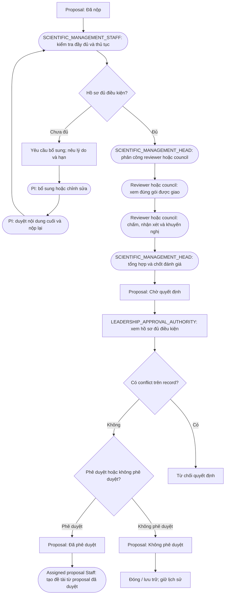

# Approval flow

```mermaid
flowchart TD
  submitted["Proposal: Đã nộp"]
  completeness(["SCIENTIFIC_MANAGEMENT_STAFF: kiểm tra đầy đủ và thủ tục"])
  complete{"Hồ sơ đủ điều kiện?"}
  supplement["Yêu cầu bổ sung; nêu lý do và hạn"]
  pi_correct(["PI: bổ sung hoặc chỉnh sửa"])
  resubmit(["PI: duyệt nội dung cuối và nộp lại"])
  assign(["SCIENTIFIC_MANAGEMENT_HEAD: phân công reviewer hoặc council"])
  review(["Reviewer hoặc council: xem đúng gói được giao"])
  score(["Reviewer hoặc council: chấm, nhận xét và khuyến nghị"])
  consolidate(["SCIENTIFIC_MANAGEMENT_HEAD: tổng hợp và chốt đánh giá"])
  ready["Proposal: Chờ quyết định"]
  authority["LEADERSHIP_APPROVAL_AUTHORITY: xem hồ sơ đủ điều kiện"]
  conflict{"Có conflict trên record?"}
  decision{"Phê duyệt hoặc không phê duyệt?"}
  approved["Proposal: Đã phê duyệt"]
  rejected["Proposal: Không phê duyệt"]
  archive["Đóng / lưu trữ; giữ lịch sử"]
  project(["Assigned proposal Staff: tạo đề tài từ proposal đã duyệt"])

  submitted --> completeness --> complete
  complete -- "Chưa đủ" --> supplement --> pi_correct --> resubmit --> completeness
  complete -- "Đủ" --> assign --> review --> score --> consolidate --> ready --> authority --> conflict
  conflict -- "Có" --> denied["Từ chối quyết định"]
  conflict -- "Không" --> decision
  decision -- "Phê duyệt" --> approved --> project
  decision -- "Không phê duyệt" --> rejected --> archive
```
