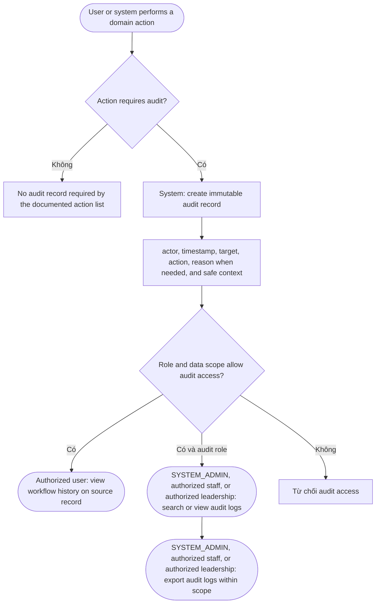

# Audit log flow

Documented audited actions include create/update/soft-delete, workflow state
changes, assignments, delegation, important file access, decisions,
post-submission edits, reopen, withdrawal, profile linking, and account/role/
scope changes. Audit history is immutable; business records, versions,
relationships, decisions, and audit records are not hard-deleted.
