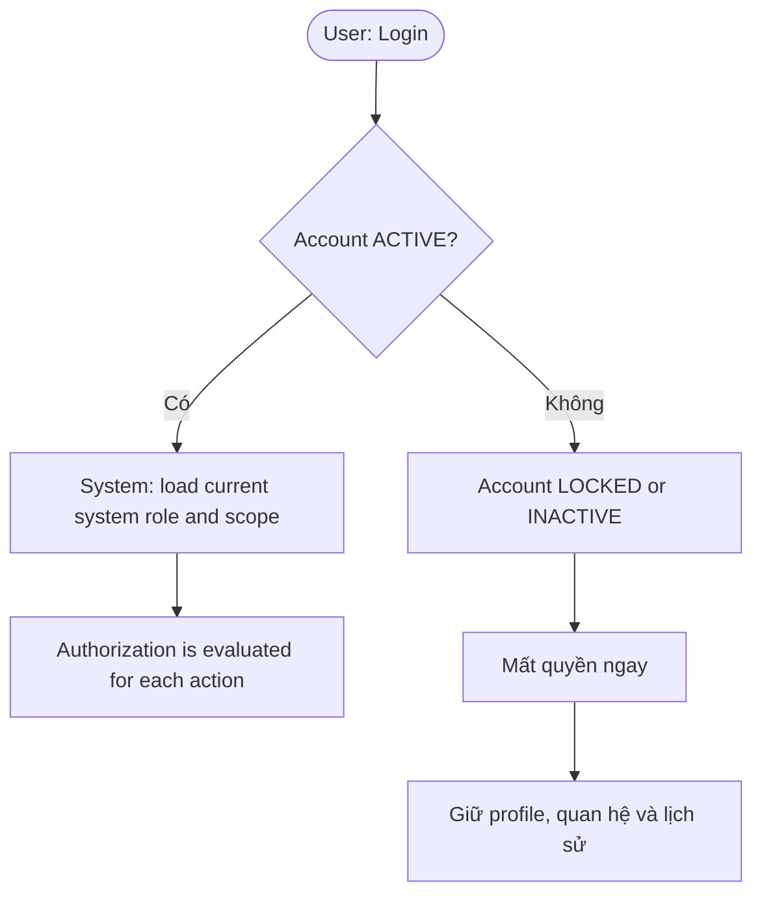

# Authentication flow

`docs/user-flows.md` documents account status and authorization context, but it
does not define credential validation, logout, or password reset behavior.
Those paths are therefore not invented here.

Not documented in the source: invalid credentials, logout, and password reset.
