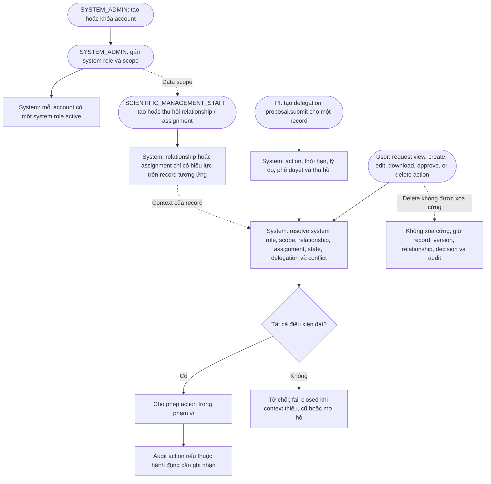

# Authorization and permission flow

`SYSTEM_ADMIN` không mặc nhiên được xem hoặc sửa dữ liệu nghiệp vụ, phản biện,
phê duyệt, hoặc mở lại hồ sơ. Có role, scope, relationship, assignment và
state không làm mất conflict policy.
