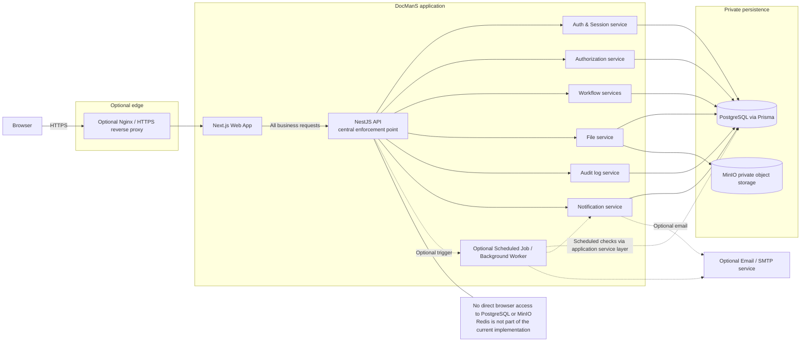
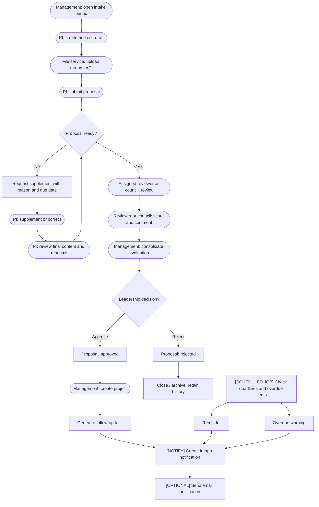
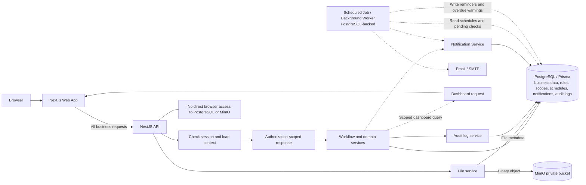
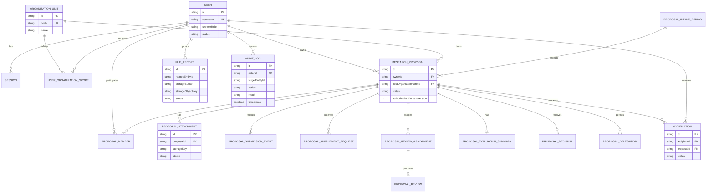
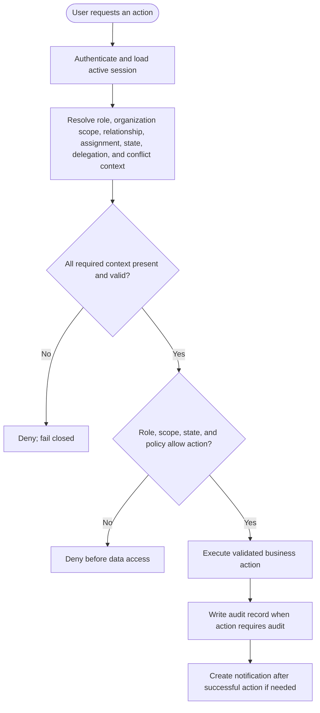
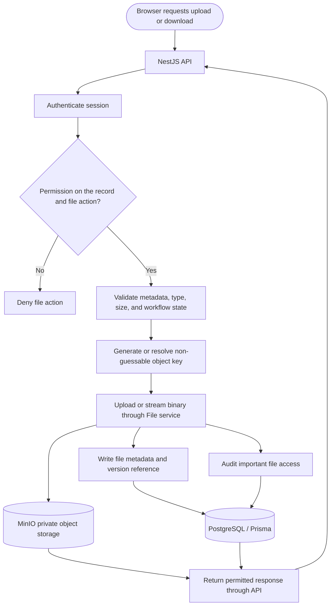

# DocManS current architecture and safety diagrams

These diagrams describe the current DocManS architecture. Optional components
are marked explicitly; no future infrastructure is shown as deployed.

## 1. System Context / Container Architecture

The reverse proxy and scheduled worker are optional deployment components.
Business requests, authentication, authorization, validation, workflow rules,
and audit logging remain enforced by the NestJS API.

## 2. End-to-End Business Workflow

Reminders, overdue warnings, and task generation are independent of any queue
or cache. Scheduled checks use PostgreSQL as the source of truth.

## 3. Data Flow Diagram / DFD mức an toàn

Redis is intentionally excluded because it is not part of the current DocManS
implementation.

## 4. Core Data Model / ERD logic

Business records, versions, relationships, decisions, workflow history, and
audit records are retained; audit history is append-only or immutable where
appropriate. No queue or cache entity is required.

## 5. Authorization Decision Flow

Role alone is not sufficient. Scope, record relationship or assignment,
workflow state, delegation, and conflict checks are evaluated before data
access. `SYSTEM_ADMIN` does not automatically receive business-record access.

## 6. File Upload / Download Safety Flow

The MinIO bucket is private. The browser never accesses PostgreSQL, MinIO, or
an object-storage bucket directly; upload and download always pass through API
permission checks.

## 7. Feasibility & Safety Check

- [x] Browser business requests go through the Next.js Web App and NestJS API.
- [x] NestJS API is the central enforcement point for authentication,
  authorization, validation, workflow rules, and audit logging.
- [x] Dashboard, list, search, detail, export, and file metadata queries are
  authorization-scoped.
- [x] File metadata is stored in PostgreSQL; file binaries are stored in a
  private MinIO bucket.
- [x] No actor accesses PostgreSQL or MinIO directly.
- [x] Scheduled Job / Background Worker can process reminders and overdue
  warnings using PostgreSQL as the source of truth.
- [x] Audit logs and workflow history are append-only or immutable where
  appropriate.
- [x] Redis is not part of the current implementation; only consider it as a
  future extension if queue/cache requirements become necessary.
