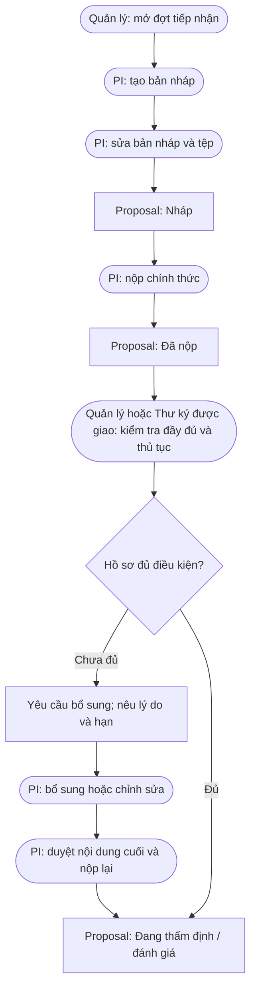

# Document creation flow

In the source terminology, the document creation path is the proposal draft
and submission workflow.

The source does not define a separate `metadata` step; metadata entry is not
added as a new business step.
