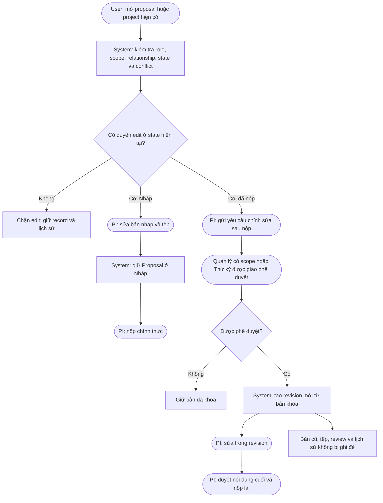

# Document editing flow

Changing mục tiêu, kinh phí, nhân sự, thời hạn, or kết quả uses `Yêu cầu điều chỉnh chính thức`, not the ordinary post-submission revision flow. File
replacement creates a new version and does not overwrite evidence.
