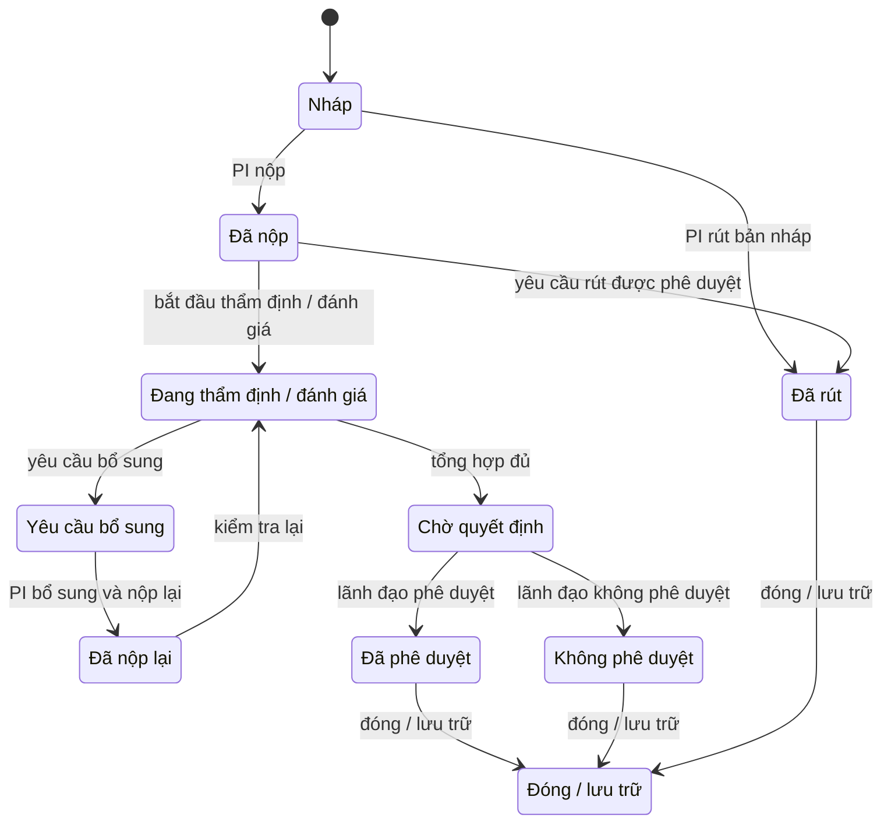
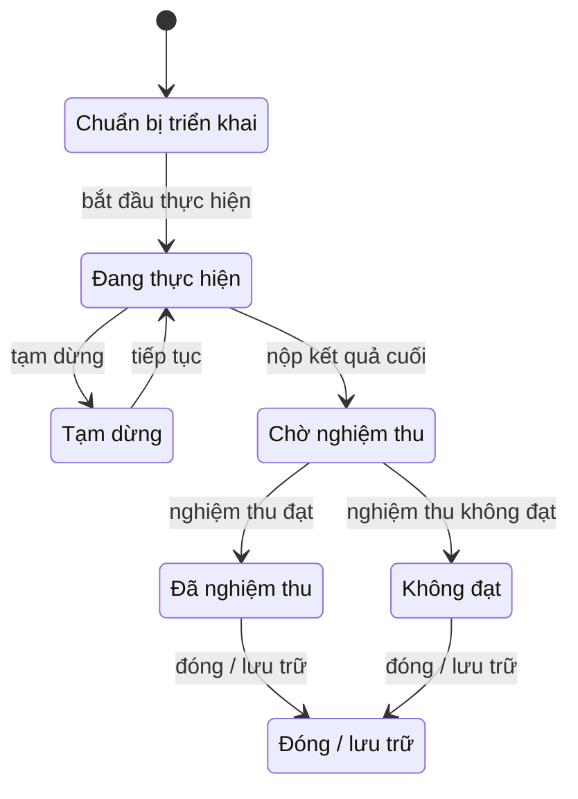

# Document lifecycle and state diagram

## Proposal

## Project

`Quá hạn` is a tracking/reminder flag, not a state transition. `Đã rút` is
documented as the result of the withdrawal exception; `Yêu cầu rút` is not a
document status.
