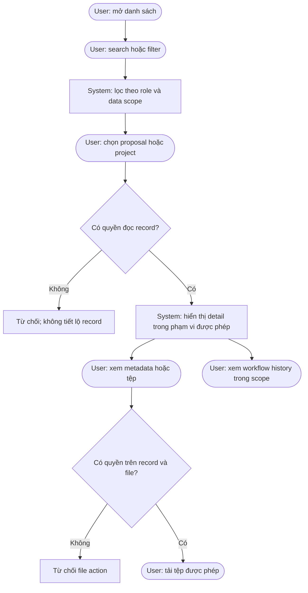

# Document viewing flow

Search, count, facet, dashboard, export, notification, and file metadata use
the same authorization filter. The source confirms that versions are retained;
it does not define a separate version-preview action.
