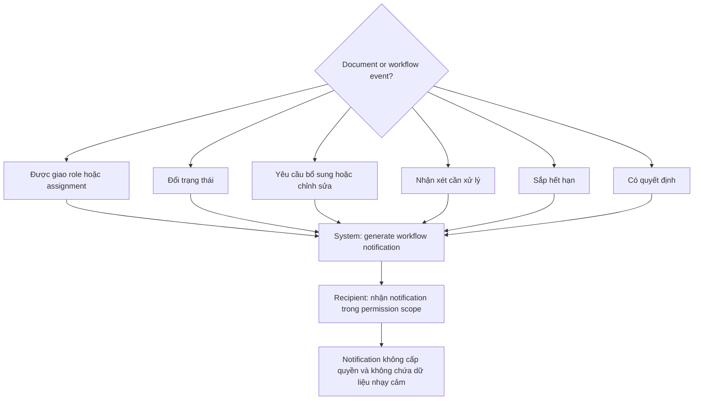

# Notification flow

```mermaid
flowchart TD
  event{"Document or workflow event?"}
  role_event["Được giao role hoặc assignment"]
  state_event["Đổi trạng thái"]
  supplement_event["Yêu cầu bổ sung hoặc chỉnh sửa"]
  action_event["Nhận xét cần xử lý"]
  deadline_event["Sắp hết hạn"]
  decision_event["Có quyết định"]
  generate["System: generate workflow notification"]
  recipient["Recipient: nhận notification trong permission scope"]
  boundary["Notification không cấp quyền và không chứa dữ liệu nhạy cảm"]

  event --> role_event --> generate
  event --> state_event --> generate
  event --> supplement_event --> generate
  event --> action_event --> generate
  event --> deadline_event --> generate
  event --> decision_event --> generate
  generate --> recipient --> boundary
```

The source documents generation and receipt of notifications. Marking a
notification as read is not documented and is not added.
