# DocManS diagram overview

Source of truth: [`../user-flows.md`](../user-flows.md).

Rounded nodes are user or role actions, rectangles are system states or
responses, and diamonds are decisions. `-.->` marks a policy boundary or an
alternative path.

```mermaid
flowchart LR
  subgraph actors["Actors"]
    admin["SYSTEM_ADMIN"]
    staff["SCIENTIFIC_MANAGEMENT_STAFF"]
    leader["LEADERSHIP_APPROVAL_AUTHORITY"]
    internal["RESEARCHER_INTERNAL_USER"]
    external["EXTERNAL_RESEARCHER_USER"]
    reviewer["Reviewer or council member"]
  end

  intake(["Mở đợt tiếp nhận"])
  draft(["Tạo bản nháp"])
  submitted["Đã nộp"]
  review["Đang thẩm định / đánh giá"]
  supplement["Yêu cầu bổ sung"]
  resubmitted["Đã nộp lại"]
  ready["Chờ quyết định"]
  decision{"Phê duyệt?"}
  approved["Đã phê duyệt"]
  rejected["Không phê duyệt"]
  proposal_archive["Đóng / lưu trữ"]
  project_create(["Tạo đề tài"])
  preparation["Chuẩn bị triển khai"]
  active["Đang thực hiện"]
  suspended["Tạm dừng"]
  awaiting["Chờ nghiệm thu"]
  acceptance{"Nghiệm thu đạt?"}
  accepted["Đã nghiệm thu"]
  not_achieved["Không đạt"]
  project_archive["Đóng / lưu trữ"]
  withdrawn["Đã rút"]

  intake --> draft --> submitted --> complete{"Hồ sơ đủ điều kiện?"}
  complete -- "Chưa đủ" --> supplement --> resubmitted --> review
  complete -- "Đủ" --> review
  review --> ready --> decision
  decision -- "Không phê duyệt" --> rejected --> proposal_archive
  decision -- "Phê duyệt" --> approved --> project_create --> preparation --> active
  active -. "Tạm dừng" .-> suspended
  suspended -. "Tiếp tục" .-> active
  active --> awaiting --> acceptance
  acceptance -- "Đạt" --> accepted --> project_archive
  acceptance -- "Không đạt" --> not_achieved --> project_archive
  submitted -. "Yêu cầu rút được phê duyệt" .-> withdrawn --> proposal_archive

  admin -. "Tài khoản, role và scope" .-> intake
  staff -. "Vận hành workflow" .-> intake
  internal -. "PI sở hữu bản nháp" .-> draft
  reviewer -. "Assignment đúng record" .-> review
  leader -. "Quyết định trong thẩm quyền" .-> decision
  external -. "Chỉ phần đóng góp được phân công" .-> draft
```

The `Yêu cầu điều chỉnh / gia hạn`, notification, file, version, and audit
details are shown in the focused diagrams below.
