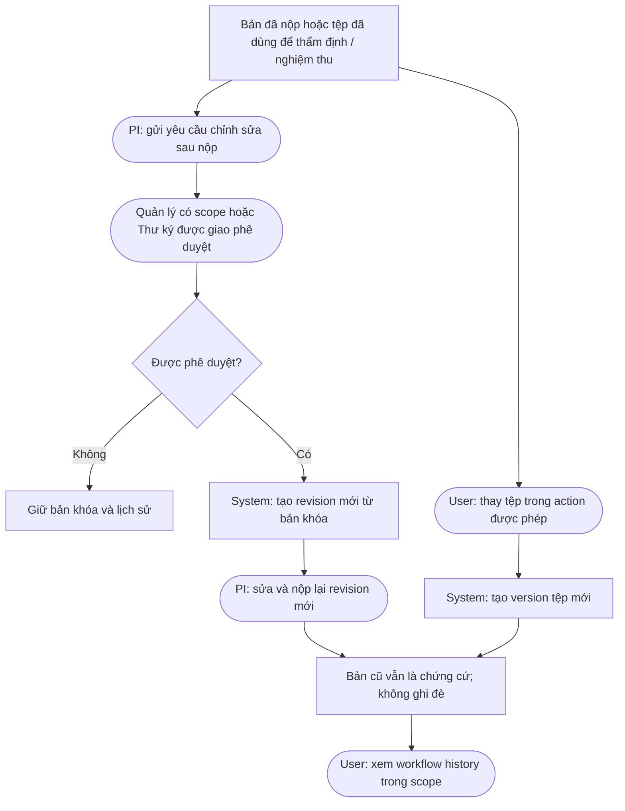

# Version management flow

```mermaid
flowchart TD
  locked["Bản đã nộp hoặc tệp đã dùng để thẩm định / nghiệm thu"]
  edit_request(["PI: gửi yêu cầu chỉnh sửa sau nộp"])
  staff_approval(["Quản lý có scope hoặc Thư ký được giao phê duyệt"])
  approved{"Được phê duyệt?"}
  unchanged["Giữ bản khóa và lịch sử"]
  new_revision["System: tạo revision mới từ bản khóa"]
  current(["PI: sửa và nộp lại revision mới"])
  old_kept["Bản cũ vẫn là chứng cứ; không ghi đè"]
  file_replace(["User: thay tệp trong action được phép"])
  file_version["System: tạo version tệp mới"]
  history(["User: xem workflow history trong scope"])

  locked --> edit_request --> staff_approval --> approved
  approved -- "Không" --> unchanged
  approved -- "Có" --> new_revision --> current --> old_kept
  locked --> file_replace --> file_version --> old_kept
  old_kept --> history
```

The source does not document restore or compare actions, so neither is shown.
