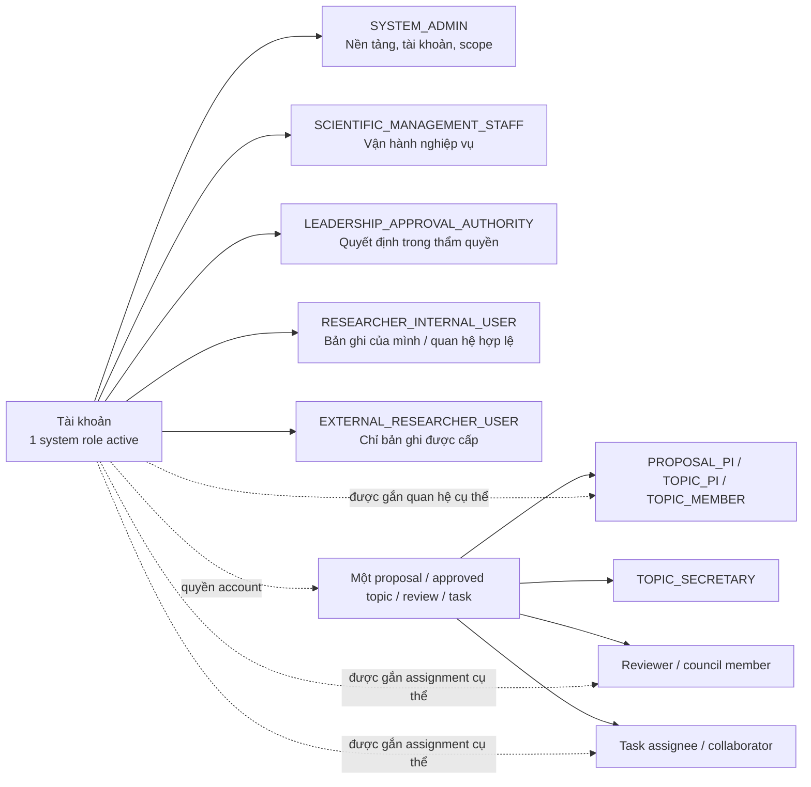
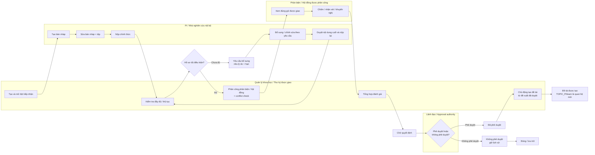
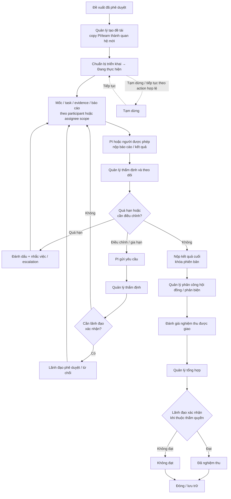
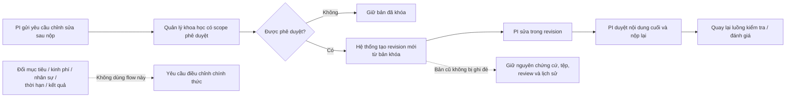
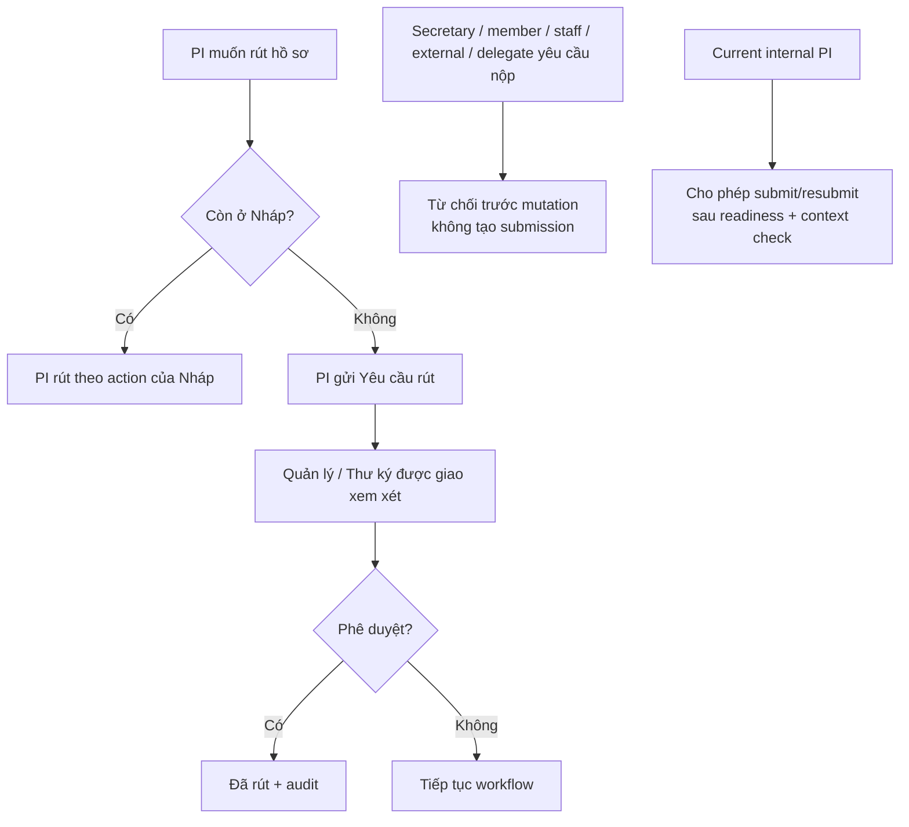
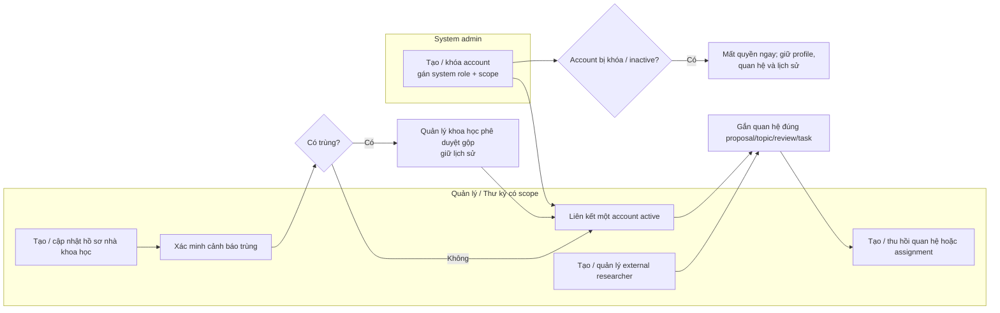
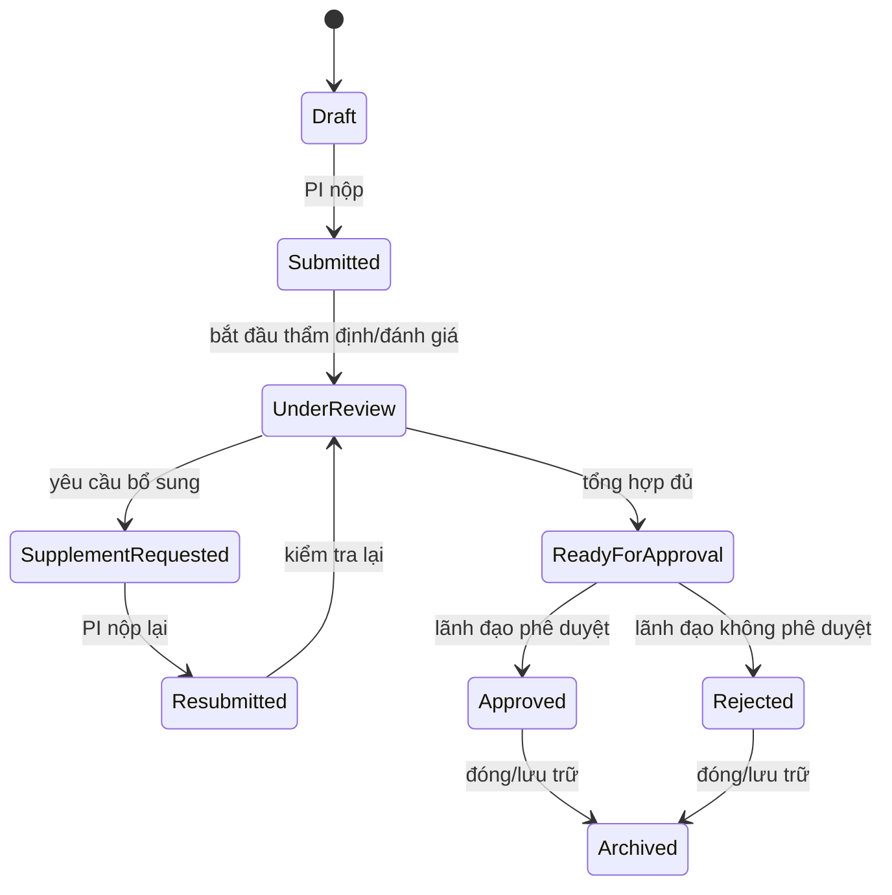
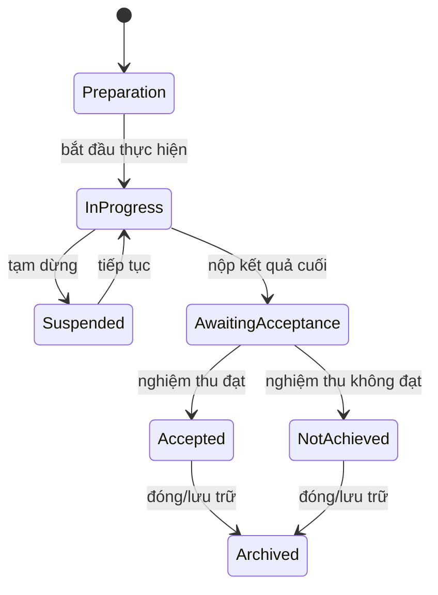

# User Flow — Vai trò và nghiệp vụ cốt lõi

> Baseline: [`authorization-core-business-baseline.md`](./authorization-core-business-baseline.md)
> Ma trận quyền: [`permission-matrix.md`](./permission-matrix.md)

Khi có khác biệt, baseline là quyết định sản phẩm mới nhất; permission matrix
là ma trận chi tiết để triển khai và kiểm thử.

Tài liệu này mô tả luồng người dùng đã chốt ở mức nghiệp vụ. Mọi nhánh đều
phải đi qua kiểm tra authorization ở backend; quyền hiển thị trên UI không thay
thế kiểm tra đó.

## Diagram index

- [Overview](./diagrams/overview.md)
- [Authentication](./diagrams/authentication.md)
- [Document creation](./diagrams/document-creation.md)
- [Document viewing](./diagrams/document-viewing.md)
- [Document editing](./diagrams/document-editing.md)
- [Approval](./diagrams/approval.md)
- [Authorization](./diagrams/authorization.md)
- [Search and filtering](./diagrams/search.md)
- [Document lifecycle](./diagrams/document-lifecycle.md)
- [Version management](./diagrams/version-management.md)
- [Notifications](./diagrams/notifications.md)
- [Audit log](./diagrams/audit-log.md)

## 1. Mô hình vai trò

Mỗi tài khoản chỉ có một `system role` đang hoạt động. `PROPOSAL_PI`,
`TOPIC_PI`, `TOPIC_SECRETARY`, `TOPIC_MEMBER`, phản biện, hội đồng và người
được giao việc là quan hệ/assignment theo đúng bản ghi, không phải quyền toàn
hệ thống. Proposal PI luôn được suy ra từ `ownerId`; PI không là team row.



## 2. Cổng kiểm tra chung cho mọi hành động

List, search, count, facet, dashboard, export, notification và file metadata
cũng đi qua cùng cổng này; thiếu hoặc mơ hồ context thì từ chối an toàn.

```mermaid
flowchart TD
  start([Người dùng yêu cầu hành động]) --> resolve["Backend resolve context hiện tại"]
  resolve --> role["System role + trạng thái tài khoản"]
  role --> scope["Organization / unit / record scope"]
  scope --> relation["Participation / assignment / applicable context"]
  relation --> state["Workflow state + action hợp lệ"]
  state --> conflict{"Có xung đột lợi ích?"}
  conflict -- "Có" --> deny["Từ chối + nêu lý do nếu phù hợp"]
  conflict -- "Không" --> allow["Cho phép hành động"]
  resolve -. "Thiếu, cũ hoặc mơ hồ" .-> deny
  allow --> audit["Audit bất biến nếu là hành động cần ghi nhận"]
  allow -. "Áp dụng cả list/search/count/facet/dashboard/export/file" .-> filtered["Kết quả đã lọc theo quyền"]
  deny --> end([Kết thúc])
  audit --> end
  filtered --> end
```

## 3. Luồng chính: đề xuất đến đề tài



Quy tắc cố định trong flow:

- Đợt đóng chặn hồ sơ mới nhưng không dừng hồ sơ đã nộp.
- PI hiện tại có system role `RESEARCHER_INTERNAL_USER` là người duy nhất được
  tạo, nộp và nộp lại proposal; không có đường delegation cho các hành động này.
- Reviewer chỉ thấy proposal/assignment được giao; gửi review xong thì review
  bị khóa, sửa lỗi bằng phiên bản nhận xét mới.
- Lãnh đạo chỉ quyết định ở trạng thái `Chờ quyết định`/`ready_for_approval`;
  không sửa nội dung và không tự quyết bản ghi có xung đột.
- Phê duyệt không tự động sinh project; Quản lý khoa học phải tạo và xác nhận.

## 4. Luồng đề tài đã được duyệt



## 5. Luồng ngoại lệ và kiểm soát nghiệp vụ

### 5.1. Chỉnh sửa sau khi đã nộp



### 5.2. Rút hồ sơ và kiểm soát PI-only



Proposal create, submit và resubmit đều là PI-only. Không có delegation input,
delegated capability hoặc đường tái-ủy quyền cho các hành động này; mọi actor
khác bị từ chối fail closed.

### 5.3. Hồ sơ nhà khoa học, tài khoản và assignment



`Profile INACTIVE` không nhận assignment mới. `TOPIC_SECRETARY` là quan hệ
theo proposal/topic; nó chỉ có thao tác theo scope/assignment và không có quyền
phê duyệt cuối.

### 5.4. Xung đột, tệp, thông báo và audit

```mermaid
flowchart TD
  action["Assignment / decision / file action"] --> conflict_check{"Actor có vai trò<br/>xung đột trên cùng record?"}
  conflict_check -- "PI/team member tự phản biện hoặc nghiệm thu" --> blocked["Chặn"]
  conflict_check -- "Reviewer đã chấm tự quyết định" --> blocked
  conflict_check -- "Authority là PI/team member/reviewer" --> blocked
  conflict_check -- "Không" --> file_check["Kiểm tra quyền trên record<br/>ở mọi lần xem/tải/tải lên/thay"]
  file_check --> action_ok["Thực hiện action"]
  action_ok --> version["Tệp thay thế tạo version mới;<br/>không ghi đè chứng cứ"]
  action_ok --> notify["Thông báo trạng thái / giao việc /<br/>bổ sung / hạn / quyết định"]
  action_ok --> immutable_audit["Audit actor, thời điểm, đối tượng,<br/>action, lý do khi cần"]
  notify -. "Thông báo không cấp quyền<br/>và không chứa dữ liệu nhạy cảm" .-> end([Kết thúc])
  version --> end
  immutable_audit --> end
  blocked --> end
```

## 6. Trạng thái cốt lõi

### Đề xuất



### Đề tài



Quá hạn là cờ theo dõi/nhắc việc, không tự động từ chối, đóng hoặc chuyển
trạng thái. Không dùng cập nhật trạng thái trực tiếp để bypass các action trên.

## 7. Các giới hạn không được suy diễn từ flow

- `SYSTEM_ADMIN` không mặc nhiên xem/sửa dữ liệu nghiệp vụ, phản biện, phê
  duyệt hoặc mở lại hồ sơ.
- Có cùng đơn vị, có chức danh hiển thị hoặc có quan hệ ở bản ghi khác không
  tự cấp quyền cho bản ghi hiện tại.
- Nhà nghiên cứu không tham gia không thấy hồ sơ chỉ vì cùng đơn vị.
- `EXTERNAL_RESEARCHER_USER` không tạo/nộp đề xuất và chỉ sửa phần đóng góp
  được phân công trong bản nháp.
- Mọi bản ghi, phiên bản, quan hệ, quyết định và audit được giữ lịch sử; không
  xóa cứng.

### Proposal reviewer / council assignment refinement

Staff opens an eligible, completeness-checked proposal → searches active Scientist
Profiles → selects an eligible linked profile and reviewer/council-member duty →
sets optional effective range/deadline → confirms → backend rechecks current
eligibility and context → records assignment and audit in one transaction.
No separate account selection or implicit profile linking is performed. An empty
candidate list directs staff to profile management. A stale/denied request shows
the server error and requires refresh before retry. Revocation requires a reason,
retains assignment/review history, and removes access immediately. The normative
eligibility and disclosure boundary is the Reviewer / Council Assignment section
of `authorization-core-business-baseline.md`.


## Researcher Profile completion — 2026-09-15

[Researcher Profile / Account / My Profile contract](contracts/researcher-profile-access.md) is the current
source of truth for this feature, including API/data fields, authorization,
credential delivery, migration compatibility and history retention.

- Scoped SYSTEM_ADMIN and SCIENTIFIC_MANAGEMENT_STAFF manage internal/external
  profiles independently of Accounts, including academic/contact information,
  position, military rank, expertise, publications and self-reported project
  history (title, role, Academy/institutional/Ministry/other level, dates, status,
  notes). Profile activation and account activation remain separate actions.
- System Account / Access supports optional create-and-link, existing unlinked
  account selection, unlink and authorized credential reset/resend. Linking is
  one-to-one across all current links, including inactive records. Staff can
  provision only matching researcher roles in the profile's explicit scope.
- Staff confirms the recipient email. The system generates and hashes a temporary
  password, sends login information by configured SMTP, and requires a different
  password before any normal authenticated API/UI feature. No plaintext credential
  is persisted, returned to staff or placed in audit. SMTP acceptance is not proof
  of inbox delivery; a failed/uncertain send has an explicit new-credential retry.
- My Profile uses the active Account's current link. Only own personal/scientific
  fields are editable; type, status, linkage and role/scope remain administrative.
  Unlink immediately removes self access. Self-reported history grants no access
  to operational projects/proposals and does not replace source-owned assignments.
- Profile/link/account/credential/first-password-change audit is preserved with
  safe transactional change facts. No test files are written or changed for this
  completion at the user's instruction; verification is recorded in its artifact.

### Profile onboarding and self completion

`Scoped staff/admin saves profile → confirms recipient email → creates and links
Account → system sends temporary login credential → researcher logs in → mandatory
password change → sign in with new password → My Profile completion`.

Accountless branch: save profile and continue directory/history management. No
account or email is required until access is requested. Existing-account branch:
select an eligible unlinked matching-role account and link without changing its
role/scope. Delivery failure branch: inspect pending/unknown status, confirm email
and reason, issue a new credential. Unlink branch: enter reason, end current link,
retain history, remove My Profile access immediately.
